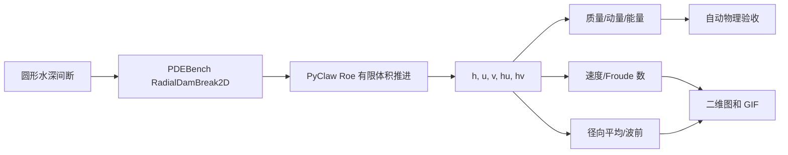

# 案例一：基于 PDEBench/PyClaw 的二维径向溃坝浅水波模拟

> **案例性质**：这是数值模拟/数据生成案例，不是机器学习训练。运行过程中没有神经网络、训练集、损失函数或 epoch；输出场是 Roe 有限体积法对浅水方程的直接数值近似解。

完成本案例后，应能：识别水深、速度、动量和 Froude 数；解释涌浪、稀疏波及数值耗散；用守恒量和旋转对称性检查结果；区分输出时间间隔与求解器内部步长；正确解读以细网格数值解为参照的自收敛研究。

# 1. 案例描述

## 1.1 术语与物理模型

### 浅水方程

浅水方程（Shallow-Water Equations, SWE）描述水平尺度远大于水深时的自由表面流动。它并不意味着水一定很浅，而是垂向加速度相对较弱，可以把三维流体沿水深方向积分，转化为二维守恒律。海啸传播、河道洪水、溃坝、潮汐和城市内涝都可在合适尺度下用它建模。

本案例的守恒变量为

$$
\mathbf q=\begin{bmatrix}h&hu&hv\end{bmatrix}^{\mathrm T},
$$

其中 $h$ 是水深，$u,v$ 是 $x,y$ 方向的深度平均速度，$hu,hv$ 是单位宽度动量。平坦底床、无摩擦时的二维方程为

$$
\frac{\partial h}{\partial t}
+\frac{\partial(hu)}{\partial x}
+\frac{\partial(hv)}{\partial y}=0,
$$

$$
\frac{\partial(hu)}{\partial t}
+\frac{\partial}{\partial x}\left(hu^2+\frac12gh^2\right)
+\frac{\partial(huv)}{\partial y}=0,
$$

$$
\frac{\partial(hv)}{\partial t}
+\frac{\partial(huv)}{\partial x}
+\frac{\partial}{\partial y}\left(hv^2+\frac12gh^2\right)=0.
$$

三个方程分别表达质量守恒和两个方向的动量守恒。压力项 $gh^2/2$ 是自由表面重力恢复力产生的静水压力通量。

### 径向溃坝问题

计算域为 $[-2.5,2.5]^2$。初始时刻，半径 $R_0=0.5$ 的圆形区域水深为 2，外部水深为 1，速度处处为零：

$$
h(x,y,0)=
\begin{cases}
2,&\sqrt{x^2+y^2}\le0.5,\\
1,&\sqrt{x^2+y^2}>0.5,
\end{cases}
\qquad u=v=0.
$$

去掉理想圆形挡水墙后，水深间断分裂为两类波：向外传播的环形涌浪（bore）把动量传向低水位区；向内传播的稀疏波（rarefaction）使中心水位下降。这个问题同时含有间断、波传播、守恒和旋转对称性，是检验双曲守恒律求解器的经典算例。

### Froude 数

Froude 数比较流速与重力波速：

$$
Fr=\frac{\sqrt{u^2+v^2}}{\sqrt{gh}}.
$$

$Fr<1$ 表示亚临界流，重力波可以向上下游两个方向传播；$Fr>1$ 表示超临界流。本案例实测最大 $Fr=0.5275$，整体保持亚临界。

## 1.2 求解模型与数值方法

### 有限体积离散

PDEBench 的 `RadialDamBreak2D` 使用 Clawpack/PyClaw。有限体积法不直接逼近某个点的导数，而是对每个网格单元积分守恒律，通过单元边界数值通量更新单元平均值：

$$
\mathbf q_{ij}^{n+1}=\mathbf q_{ij}^{n}
-\frac{\Delta t}{\Delta x}(\hat{\mathbf F}_{i+1/2,j}-\hat{\mathbf F}_{i-1/2,j})
-\frac{\Delta t}{\Delta y}(\hat{\mathbf G}_{i,j+1/2}-\hat{\mathbf G}_{i,j-1/2}).
$$

相邻单元共享同一通量，一个单元流出的质量正是另一个单元流入的质量，因此天然适合守恒律。

### Roe 黎曼求解器与限制器

每个网格界面两侧的状态不连续，会形成局部黎曼问题。PDEBench 选择 `shallow_roe_with_efix_2D`：

- Roe 线性化把状态跳跃分解为三个特征波；
- entropy fix 修正稀疏波附近不满足熵条件的非物理解；
- MC（Monotonized Central）TVD 限制器抑制间断附近的 Gibbs 型振荡；
- 四周采用外推边界。$t\le1$ 时主波尚未到达边界，因此边界对核心结果影响很小。

网格为 $128\times128$，$\Delta x=\Delta y=0.0390625$，输出 101 帧。内部时间步由 PyClaw 按稳定性条件自适应控制，`0.01` 是输出帧间隔，并不是强制的内部积分步长。

## 1.3 案例设计与上游代码关系

PDEBench 官方 HDF5 保存函数默认只写出水深 `h`，但求解器内部同时推进并记录 `h、u、v、hu、hv`。本案例直接实例化官方 `RadialDamBreak2D`，不修改 Roe 求解器或时间推进，只在驱动层把五个场完整保存，以便做物理诊断。



### 实现与上游代码的对应关系

| 本案例步骤 | 实际调用/实现 | 是否改动上游算法 |
|---|---|---|
| 方程推进 | `pdebench.data_gen.src.sim_radial_dam_break.RadialDamBreak2D` | 否 |
| 界面通量 | PyClaw `shallow_roe_with_efix_2D` | 否 |
| 限制器/边界 | MC TVD / extrapolation | 否 |
| 全场保存 | 从上游对象的 `save_state` 读取 `h,u,v,hu,hv` | 仅扩展输出 |
| 物理诊断和图像 | 本案例 `analyze_and_visualize.py` | 后处理 |
| 网格研究 | 同一上游求解器运行 32²、64²、128² | 独立验证 |

固定提交中的一个上游细节是：构造函数虽然接收 `inner_height`，`set_initial_conditions()` 却把内部水深写死为 `2.0`。因此本案例会拒绝其他 `inner_height`，避免配置文件记录了求解器实际没有采用的值。

# 2. 前处理

## 2.1 创建独立环境

```bash
git clone https://github.com/shenyun114/pdebench_case.git
cd pdebench_case/01_radial_dam_break
export PDEBENCH_CASE_DATA=/home/ubuntu/data  # 可替换为本机数据盘
mkdir -p "$PDEBENCH_CASE_DATA/conda-envs"
conda env create --prefix "$PDEBENCH_CASE_DATA/conda-envs/pdebench-swe" -f environment.yml
conda activate "$PDEBENCH_CASE_DATA/conda-envs/pdebench-swe"
```

该案例完全在 CPU 上运行，不需要 CUDA。环境包含 Python、NumPy、HDF5、Matplotlib/Pillow、PyTorch（上游源码初始化时使用）以及 Clawpack/PyClaw。

把环境前缀放在 `/home/ubuntu/data` 可避免占用个人文件夹空间。若已有 `pdebench-fno` 且其中安装了 Clawpack，也可用于开发调试：

```bash
conda activate pdebench-fno
python -c "from clawpack import pyclaw, riemann; print('Clawpack OK')"
```

## 2.2 在数据盘准备固定版本源码

```bash
bash scripts/setup_workspace.sh "$PDEBENCH_CASE_DATA/pdebench-swe-demo"
```

脚本会克隆官方仓库、固定到提交 `4ff3e3a4...`，并验证浅水求解器可以导入。源码和数据都位于数据盘，不占用个人目录的大容量空间。

# 3. 并行优化与数值执行

PDEBench 固定提交中的 `RadialDamBreak2D` 由单进程 PyClaw 推进，本案例没有把单个网格人为拆分成 MPI 任务，也不虚构并行加速比。这里的优化重点是使用已编译的 Roe 波传播内核、避免重复求解、将大体积数据写入数据盘，并通过 32²/64²/128² 研究精度—成本关系。若要开展真正的空间域并行，需要换用支持 MPI 域分解的 Clawpack/PETSc 工作流，超出当前小案例范围。

## 3.1 配置参数

默认参数集中在 [`configs/default.yaml`](configs/default.yaml)，不再隐藏在 Shell 命令中。要开展新实验，复制配置并修改副本，然后把路径作为流水线第二个参数传入：

```bash
cp configs/default.yaml "$PDEBENCH_CASE_DATA/swe-custom.yaml"
# 编辑副本后运行
bash scripts/run_pipeline.sh "$PDEBENCH_CASE_DATA/pdebench-swe-custom" "$PDEBENCH_CASE_DATA/swe-custom.yaml"
```

## 3.2 一键运行

```bash
export PDEBENCH_CASE_DATA=/home/ubuntu/data
conda activate "$PDEBENCH_CASE_DATA/conda-envs/pdebench-swe"
cd "$(git rev-parse --show-toplevel)/01_radial_dam_break"
bash scripts/setup_workspace.sh "$PDEBENCH_CASE_DATA/pdebench-swe-demo"
bash scripts/run_pipeline.sh "$PDEBENCH_CASE_DATA/pdebench-swe-demo"
```

完整过程包括：

1. 用官方求解器生成 `101×128×128` 的五个物理场；
2. 写出带压缩的 HDF5；
3. 计算质量、动量、机械能、流速、Froude 数、旋转对称误差和波前半径；
4. 生成五张物理分析图和一张双面板 GIF；
5. 用 32²、64²、128² 做自收敛、成本和质量稳定性研究；
6. 自动检查字段、形状、有限值、正水深、守恒、对称性、网格误差单调下降和图像完整性。

成功结束时输出：

```text
PASS: shallow-water fields, physics diagnostics and visualizations are valid
二维浅水波案例完成：.../artifacts/results
```

为避免覆盖实验数据，流水线发现已有 HDF5 时会退出。再次运行请换目录：

```bash
bash scripts/setup_workspace.sh "$PDEBENCH_CASE_DATA/pdebench-swe-demo-02"
bash scripts/run_pipeline.sh "$PDEBENCH_CASE_DATA/pdebench-swe-demo-02"
```

## 3.3 输出结构

```text
$PDEBENCH_CASE_DATA/pdebench-swe-demo/artifacts/
├── radial_dam_break.h5
├── simulation_info.json
├── resolved_config.yaml
├── pipeline.log
└── results/
    ├── physical_metrics.json
    ├── resolution_metrics.json
    ├── water_depth_snapshots.png
    ├── surface_evolution_3d.png
    ├── velocity_and_froude.png
    ├── radial_profiles.png
    ├── conservation_diagnostics.png
    ├── resolution_study.png
    └── shallow_water_evolution.gif
```

HDF5 中各数组均有明确物理意义：

| 键 | 形状 | 含义 |
|---|---|---|
| `h` | `(101,128,128)` | 水深 |
| `u`, `v` | `(101,128,128)` | 两个方向的深度平均速度 |
| `hu`, `hv` | `(101,128,128)` | 两个方向的单位宽度动量 |
| `x`, `y` | `(128,)` | 网格中心坐标 |
| `t` | `(101,)` | 输出时间 |

## 3.4 分阶段复现与排错

一键脚本实际执行的核心命令如下；适合在某一步失败时单独重跑。`${REPO}` 指向数据盘内固定提交的 PDEBench 源码，`${CONFIG}` 指向配置副本。

```bash
export REPO="$PDEBENCH_CASE_DATA/pdebench-swe-demo/PDEBench"
export CONFIG="$PDEBENCH_CASE_DATA/pdebench-swe-demo/artifacts/resolved_config.yaml"
export ART="$PDEBENCH_CASE_DATA/pdebench-swe-demo/artifacts"

PYTHONPATH="$REPO" python src/simulate_shallow_water.py --output "$ART/radial_dam_break.h5" --config "$CONFIG" --repo "$REPO"
python src/analyze_and_visualize.py --data "$ART/radial_dam_break.h5" --output "$ART/results"
PYTHONPATH="$REPO" python src/resolution_study.py --reference-data "$ART/radial_dam_break.h5" --config "$CONFIG" --output "$ART/results"
python src/verify_results.py "$ART/radial_dam_break.h5" "$ART/results"
```

流水线正常结束时，`pipeline.log` 保留上述四阶段的参数、运行时间、完整 JSON 指标和每一项验收布尔值，可直接用于复现实验审计。

# 4. 后处理与物理分析

以下结果于 2026-08-06 在全新环境和独立工作目录重新生成。128² 主求解约 1.20 秒（已有环境复测为 0.95 秒），出图和 GIF 时间更长。完整指标见 [`results/physical_metrics.json`](results/physical_metrics.json)，网格研究见 [`results/resolution_metrics.json`](results/resolution_metrics.json)。

## 4.1 可视化阅读约定

在看图之前，需要区分四类量：

- 水深 $h$ 是标量，颜色越深表示单位水平面积上的水柱越高；它不是地形高度；
- 速度大小 $|\mathbf u|=\sqrt{u^2+v^2}$ 也是标量，箭头只表示速度方向和相对大小；为避免遮挡，箭头每隔 8 个网格抽样一次；
- Froude 数把速度除以局部重力波速，所以相同流速在浅水区会得到更大的 $Fr$；
- 径向剖面是对同一半径圆环上的值做方位平均，能滤除笛卡尔网格造成的轻微锯齿，但也会隐藏非轴对称误差。

所有二维快照使用相同色标，因而不同时刻可以直接比较。图中的白色等值线分别标记 $h=1.05、1.2、1.4$，用来跟踪低幅波前、中间过渡区和较高水位区。

## 4.2 水深场：涌浪向外、稀疏波向内

初始圆柱形高水位迅速失去垂直侧壁。外侧出现传播半径不断增大的环形波前，中心则在稀疏波作用下持续下降。识别出的主波前半径从约 `0.514` 增长到 `1.741`，平均传播速度约为 `1.23`。这个量级位于外部和内部线性重力波速 $\sqrt{gh}=1$ 与 $\sqrt2\approx1.414$ 之间，符合浅水波特征速度的预期。

逐列观察可以看到：`t=0.10` 时原始间断已经分裂，外缘白线向外移动而中心仍维持高水位；`t=0.25` 时中心稀疏波开始明显降低水位；`t=0.50` 时高水区变成环带；`t=1.00` 时主波前位于半径约 1.74 处，中心出现低水位凹陷。早期白色轮廓上的轻微方形/波纹并非新的物理不稳定性，而是圆形间断投影到笛卡尔网格、再经过方向分裂波传播后留下的网格各向异性；其量级也反映在旋转误差指标中。


## 4.3 三维自由液面

三维图更直观地展示了“高水柱—环形台阶—中心凹陷”的转换。末时刻中心低水位并非质量损失；初始多余水量已被向外传播的环形涌浪重新分配。

三个面板的竖直坐标都是真实求解变量 $h$，且使用同一高度范围和观察角度。`t=0` 的垂直圆柱侧壁代表初值间断，不是实体坝体；`t=0.35` 的环形隆起是向外行进的压缩波；`t=1` 的“碗形中心 + 外侧环脊”是向内稀疏与向外涌浪共同作用的结果。三维图适合看自由表面几何，但不适合精确读波前位置，所以定量判断应结合径向剖面。


## 4.4 速度矢量与 Froude 数

白色箭头表明主要流动沿径向向外。最大速度为 `0.5239`，最大 Froude 数为 `0.5275`，所以计算区内没有转为超临界流。后期中心附近出现局部向内径向速度，对应稀疏波之后的水面调整，而不是整体波前反向传播。

上排背景颜色是速度大小：黑色接近静止，黄色接近全时段最大速度。`t=0.20` 的高速区是一条窄环，因为动量首先集中在原坝址附近；随后环带增宽并外移。箭头在圆周各方向都向外，验证了径向对称的压力驱动。

下排是同一时刻的 Froude 数。它与速度图相似但不完全相同，因为分母还包含 $\sqrt h$。在中心水深降低以后，即使速度没有达到全局最大值，$Fr$ 仍可能相对升高。全图最大值小于 1，意味着局部信息仍能以重力波形式双向传播；图中不存在必须用超临界激波解释的区域。


## 4.5 径向剖面

对同一半径上的网格单元做方位平均，可以把二维环形结构压缩为清晰的一维波形。水深图显示外波前持续右移；径向速度图则显示非零速度区不断扩展。相比只画二维色彩图，剖面更适合定量比较波高、坡度和传播距离。

左图灰色虚线是初始坝半径 `r=0.5`。`t=0` 的阶跃从 2 跳到 1；后续曲线右侧陡降位置就是外行波前，左侧缓坡则属于稀疏扇。到 `t=1`，中心平均水深降到约 0.9 以下，环脊约为 1.2，外部未受扰动区仍保持 1。

右图正值表示径向向外、负值表示向内。早中期大部分受扰区速度为正；`t=0.75` 和 `t=1` 的中心出现负值，说明中心低水位形成后发生局部回调。外侧速度突然回到零的位置与水深波前一致，这种跨物理量的一致性是判断可视化可信的重要证据。


## 4.6 守恒量与数值耗散

本机结果为：

| 诊断量 | 实测值 | 解释 |
|---|---:|---|
| 初始/最终总质量 | `25.79956055 / 25.79956054` | 后处理用 float64 累加 |
| 最大相对质量漂移 | `4.79×10⁻¹⁰` | 远低于 `10⁻⁵` 验收阈值 |
| 初始/最终总机械能 | `13.69934 / 13.62710` | 降低约 `0.527%` |
| 最大整体 $x$ 动量 | `1.04×10⁻¹⁵` | 对称性保持 |
| 最大整体 $y$ 动量 | `2.78×10⁻¹⁵` | 仅为舍入级残差 |
| 最大四重旋转相对误差 | `4.80×10⁻⁴` | 笛卡尔网格造成轻微方向性 |
| 最小水深 | `0.2832` | 全程保持正水深 |

无摩擦连续方程的总机械能理论上守恒。本例能量缓慢降低而质量不变，说明损失来自 Roe 通量和 TVD 限制器为稳定捕捉间断所引入的数值耗散，而不是漏水。能量单调下降也优于出现非物理增长。

四个子图应组合阅读：左上质量曲线贴着零线，说明离散通量在相邻单元间严格抵消；右上能量平滑下降，量化了稳定捕捉间断所付出的耗散代价；左下整体动量只在 $10^{-9}$ 量级波动，说明圆周各方向动量互相抵消；右下最大速度和最大 Froude 数先增长、后降低、末段略回升，对应“压力势能释放—波带扩展减速—中心回调”的三个阶段。


## 4.7 动态演化 GIF

左图同步显示水深，右图显示速度大小和方向；标题同时给出时间与相对质量漂移。播放时可以用左图外缘等色带的位置判断波前，用右图亮环和箭头判断动量传播。两幅图应同步向外扩张；若出现水深波前移动而速度环停滞，通常意味着数据通道或时间索引错位。本结果中二者保持同步，标题中的质量漂移也始终处于验收容差内。


## 4.8 三网格自收敛与计算成本

这张图回答“图像看起来合理之外，网格加密后解是否趋于稳定”。32² 和 64² 的末时刻水深分别与 128² 解的守恒块平均结果比较：

| 网格 | 运行时间/s | 相对 L1 误差 | 相对 L2 误差 | 最大质量漂移 |
|---:|---:|---:|---:|---:|
| 32² | 0.150 | 1.107% | 2.015% | `3.47×10⁻¹¹` |
| 64² | 0.307 | 0.534% | 1.202% | `2.16×10⁻¹⁶` |
| 128² | 1.204 | 参考值 | 参考值 | `4.79×10⁻¹⁰` |

左图中 64² 的误差低于 32²，说明加密网格确实向细网格结果靠拢；由两级粗网格估计的 L2 观测阶约为 `0.75`。它低于光滑解区域中高阶格式的理想阶数并不反常：初始水深包含不连续面，演化中又有陡峭涌浪，跨间断的全局误差通常只有较低收敛阶。中图显示分辨率提高带来的运行成本；右图显示三种网格都稳定满足质量阈值。

这里的 128² 是“最细数值参考解”，不是解析真解，所以这项结果应称为自收敛/网格一致性证据，不能写成严格解析误差。若要给出更可靠的渐近阶，需要继续加入 256² 或 512²，并确认研究进入渐近收敛区。


## 4.9 性能边界与扩展建议

本案例规模较小，单进程足够。若要形成 HPC 案例，可从三条路径扩展：

- 增加到 `512×512` 或更高分辨率，研究网格收敛与波前厚度；
- 批量改变初始坝半径和内外水深，用多进程生成 PDEBench 数据集；
- 保存多个分辨率，对比数值耗散、旋转对称误差和运行时间，形成精度—成本曲线。

若进一步做机器学习，可以用这里保存的 `h、u、v` 训练多通道 FNO/U-Net，再同时评价场误差、质量漂移、能量误差和波前位置误差。仅比较像素 RMSE 无法判断预测是否遵守浅水物理。

## 4.10 参考资料

- [PDEBench 官方仓库](https://github.com/pdebench/PDEBench)
- [PDEBench 论文](https://proceedings.neurips.cc/paper_files/paper/2022/hash/0a9747136d411fb83f0cf81820d44afb-Abstract-Datasets_and_Benchmarks.html)
- PDEBench 源码：`pdebench/data_gen/src/sim_radial_dam_break.py`
- Clawpack/PyClaw：守恒律有限体积与波传播算法
