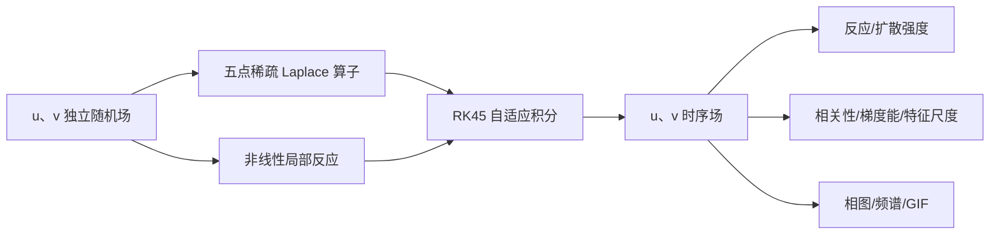

# 案例二：PDEBench 二维耦合反应–扩散斑图演化

> **案例性质**：这是 PDEBench 数值模拟/数据生成案例，不是 FNO、U-Net 或 PINN 训练。没有 epoch 或 loss；每一帧都是对离散反应–扩散方程组直接积分得到的数值解。

完成本案例后，应能：解释激活场/恢复场、局部反应和扩散的作用；从相平面、相关性、梯度能和空间频谱识别图案粗化；使用与求解器完全一致的五点 Laplace 算子做机理诊断；正确设计随机初值下的网格一致性比较。

# 1. 案例描述

## 1.1 背景与物理图景

反应–扩散系统描述“局部发生反应、物质同时向邻域扩散”的过程。化学浓度、生态种群、神经兴奋、催化表面和形态发生都可以抽象成这类方程。单纯扩散只会把空间差异抹平；非线性反应则可能放大、限制或耦合局部状态。二者竞争后，会出现传播波、斑点、条纹或缓慢粗化的相区。

PDEBench 的二维模型包含两个无量纲场：

- $u(x,y,t)$：变化较快、扩散较慢的激活场；
- $v(x,y,t)$：对 $u$ 起恢复/抑制作用、扩散更快的场。

控制方程为

$$
\frac{\partial u}{\partial t}
=D_u\nabla^2u+u-u^3-k-v,
$$

$$
\frac{\partial v}{\partial t}
=D_v\nabla^2v+u-v.
$$

本案例取

$$
D_u=10^{-3},\qquad D_v=5\times10^{-3},\qquad k=5\times10^{-3}.
$$

$v$ 的扩散系数是 $u$ 的 5 倍，所以它对高频空间噪声的响应更快、更平滑。$u-u^3$ 中的负三次项会限制振幅，避免线性增长无限放大；$-v$ 和 $u-v$ 将两个场耦合起来。

边界满足齐次 Neumann 条件：

$$
\frac{\partial u}{\partial n}=
\frac{\partial v}{\partial n}=0,
$$

表示边界没有扩散通量。与浅水方程不同，$u,v$ 并不是守恒量：反应项会改变空间平均值，因此评价重点应放在机制平衡、场间耦合、梯度衰减和空间尺度，而不是要求“总质量不变”。

## 1.2 数值方法

### 空间离散

PDEBench 源码在 `sim_diff_react.py` 中构造二维五点稀疏 Laplace 矩阵。以 $u$ 为例，内部网格点近似为

$$
\nabla^2u_{ij}\approx
\frac{u_{i+1,j}-2u_{ij}+u_{i-1,j}}{\Delta x^2}
+\frac{u_{i,j+1}-2u_{ij}+u_{i,j-1}}{\Delta y^2}.
$$

边界对角项经过修改，使离散算子对应零法向梯度。网格为 $128\times128$，区域为 $[-1,1]^2$，所以 $\Delta x=\Delta y=0.015625$。

### 时间积分

离散后得到包含 32,768 个未知量的常微分方程组。PDEBench 调用 SciPy `solve_ivp` 的默认 RK45 自适应显式积分器，在 $t\in[0,5]$ 上保存 101 帧。输出间隔为 0.05；内部时间步由局部误差控制自动决定，并不固定为 0.05。

### 初始条件

`seed=7` 生成两个互不相关的标准正态随机场。随机初态不是为了模拟某一种具体化学配方，而是同时激发宽范围空间频率，用来观察系统怎样选择并保留大尺度结构。



## 1.3 实现与上游代码的对应关系

| 本案例步骤 | 实际调用/实现 | 说明 |
|---|---|---|
| 主数值解 | `pdebench.data_gen.src.sim_diff_react.Simulator.generate_sample()` | 官方实现，不改方程 |
| 反应项 | `Simulator.rc_ode()` 中的两组局部非线性 | 官方实现 |
| 扩散项 | 官方稀疏五点 Laplace 矩阵 | 零通量边界 |
| 时间推进 | SciPy `solve_ivp` 默认 RK45 | 官方实现 |
| 机理图 | 用同一五点矩阵重算 $D_u\nabla^2u,D_v\nabla^2v$ | 与求解器离散一致 |
| 网格研究 | 调用官方 `Simulator.rc_ode()`，仅把同一初值投影到粗网格 | 独立验证 |

早期版本的后处理曾用两次 `np.gradient` 近似 Laplace 项。那种算法在边界闭合和离散系数上与 PDEBench 不完全相同，现已改为逐项复刻上游稀疏矩阵；因此机制 RMS 图现在衡量的是求解器实际采用的扩散率。

# 2. 前处理

## 2.1 创建环境

```bash
git clone https://github.com/shenyun114/pdebench_case.git
cd pdebench_case/02_reaction_diffusion
export PDEBENCH_CASE_DATA=/home/ubuntu/data  # 可替换为本机数据盘
export PDEBENCH_ROOT="$PDEBENCH_CASE_DATA/pdebench-upstream/PDEBench"
mkdir -p "$PDEBENCH_CASE_DATA/conda-envs"
conda env create --prefix "$PDEBENCH_CASE_DATA/conda-envs/pdebench-reacdiff" -f environment.yml
conda activate "$PDEBENCH_CASE_DATA/conda-envs/pdebench-reacdiff"
```

该案例只使用 CPU，不需要 PyTorch、CUDA 或 FNO。环境前缀位于数据盘，不占用个人目录的大容量空间。若现有 `pdebench-fno` 已包含 NumPy、SciPy、HDF5、Matplotlib 和 Pillow，也可以用于开发调试。

## 2.2 准备固定版本源码

```bash
bash scripts/setup_workspace.sh "$PDEBENCH_CASE_DATA/pdebench-reacdiff-demo"
```

脚本会把 PDEBench 克隆到数据盘并固定到提交 `4ff3e3a4aa1561721b5571fa3a048a0a463e0568`。

# 3. 并行优化与数值执行

该 PDEBench `Simulator` 把空间离散后得到的 32,768 维 ODE 交给单进程 SciPy RK45。当前小案例没有 MPI 或 GPU 路径，因此不报告虚构的并行加速比；性能分析采用 32²/64²/128² 网格的实际运行时间，展示显式扩散问题随自由度和稳定步长增加的成本。批量数据生成时，不同随机种子彼此独立，后续可以沿案例三的样本级并行方式扩展。

## 3.1 运行完整流水线

```bash
export PDEBENCH_CASE_DATA=/home/ubuntu/data
export PDEBENCH_ROOT="$PDEBENCH_CASE_DATA/pdebench-upstream/PDEBench"
conda activate "$PDEBENCH_CASE_DATA/conda-envs/pdebench-reacdiff"
cd "$(git rev-parse --show-toplevel)/02_reaction_diffusion"
bash scripts/setup_workspace.sh "$PDEBENCH_CASE_DATA/pdebench-reacdiff-demo"
bash scripts/run_pipeline.sh "$PDEBENCH_CASE_DATA/pdebench-reacdiff-demo"
```

默认参数集中在 [`configs/default.yaml`](configs/default.yaml)。流水线依次生成数值解、保存配置和日志、用精确上游离散算子计算派生量、生成 6 张物理图和 GIF、开展三网格一致性研究，并自动验收。自定义参数可通过第二个参数传入：

```bash
cp configs/default.yaml "$PDEBENCH_CASE_DATA/reacdiff-custom.yaml"
bash scripts/run_pipeline.sh "$PDEBENCH_CASE_DATA/pdebench-reacdiff-custom" "$PDEBENCH_CASE_DATA/reacdiff-custom.yaml"
```

成功输出为：

```text
PASS: reaction-diffusion fields, mechanisms and visualizations are valid
二维反应–扩散案例完成：.../artifacts/results
```

本案例已在独立数据盘工作目录从空目录完整复现。128² 主数值积分在两次测试中约需 7.76–10.29 秒（运行时间随共享机器负载变化）；GIF 渲染时间更长。

## 3.2 输出数据

```text
artifacts/
├── reaction_diffusion.h5
├── simulation_info.json
├── resolved_config.yaml
├── pipeline.log
└── results/
    ├── physical_metrics.json
    ├── resolution_metrics.json
    ├── field_snapshots.png
    ├── coupled_state.png
    ├── phase_portrait.png
    ├── mechanism_balance.png
    ├── pattern_diagnostics.png
    ├── spatial_spectrum.png
    ├── resolution_study.png
    └── reaction_diffusion_evolution.gif
```

HDF5 中 `u` 和 `v` 的形状均为 `(101,128,128)`，另外保存 `x、y、t` 坐标以及 $D_u,D_v,k$、随机种子、边界和求解器信息。

## 3.3 分阶段运行

需要单独调试初值、积分器或可视化时，可在同一个终端中依次执行下面三段命令。分阶段命令与 3.1 节的一键脚本使用相同代码，但输入输出更加明确。请为新实验指定新的 `WORK_ROOT`。

### 3.3.1 前处理

```bash
export PDEBENCH_CASE_DATA=/home/ubuntu/data
export PDEBENCH_ROOT="$PDEBENCH_CASE_DATA/pdebench-upstream/PDEBench"
conda activate "$PDEBENCH_CASE_DATA/conda-envs/pdebench-reacdiff"
cd "$(git rev-parse --show-toplevel)/02_reaction_diffusion"
export CASE_DIR="$PWD"
export WORK_ROOT="$PDEBENCH_CASE_DATA/pdebench-reacdiff-staged"
export REPO="$PDEBENCH_ROOT"
export ART="$WORK_ROOT/artifacts"
export CONFIG="$ART/resolved_config.yaml"

bash scripts/setup_workspace.sh "$WORK_ROOT"
mkdir -p "$ART/results"
cp configs/default.yaml "$CONFIG"
```

[`scripts/setup_workspace.sh`](scripts/setup_workspace.sh) 克隆并固定 PDEBench，验证反应–扩散模拟器可以导入；[`configs/default.yaml`](configs/default.yaml) 定义网格、边界、随机种子、扩散系数和输出时刻。`PDEBENCH_ROOT` 指定共用源码位置，`WORK_ROOT` 指定本案例输出位置；前处理输出 `$REPO`、`$CONFIG` 和空的结果目录。

### 3.3.2 算法运行

```bash
PYTHONPATH="$REPO" python "$CASE_DIR/src/simulate_reaction_diffusion.py" \
  --output "$ART/reaction_diffusion.h5" \
  --config "$CONFIG" \
  --repo "$REPO"
```

[`src/simulate_reaction_diffusion.py`](src/simulate_reaction_diffusion.py) 调用 PDEBench 的稀疏 Laplace 算子和 RK45 积分流程，输出 `$ART/reaction_diffusion.h5` 与 `$ART/simulation_info.json`。该阶段只生成 $u,v$ 数值场，不渲染图片。

### 3.3.3 后处理

```bash
python "$CASE_DIR/src/analyze_and_visualize.py" \
  --data "$ART/reaction_diffusion.h5" \
  --output "$ART/results"
PYTHONPATH="$REPO" python "$CASE_DIR/src/resolution_study.py" \
  --reference-data "$ART/reaction_diffusion.h5" \
  --config "$CONFIG" \
  --output "$ART/results"
python "$CASE_DIR/src/verify_results.py" \
  "$ART/reaction_diffusion.h5" "$ART/results"
```

后处理代码及职责如下：

| 代码 | 输入 | 输出与作用 |
|---|---|---|
| [`src/analyze_and_visualize.py`](src/analyze_and_visualize.py) | `reaction_diffusion.h5` | 双场、相图、机制、频谱等 6 张图，GIF 与 `physical_metrics.json` |
| [`src/pdebench_operators.py`](src/pdebench_operators.py) | HDF5 网格和边界参数 | 为机制诊断与网格研究复现 PDEBench 的离散 Laplace 算子 |
| [`src/resolution_study.py`](src/resolution_study.py) | HDF5、配置和官方求解器 | 三网格结果、`resolution_metrics.json` 和网格研究图 |
| [`src/verify_results.py`](src/verify_results.py) | HDF5 与 `results/` | 检查字段、边界通量、误差趋势和全部图像，成功时输出 `PASS` |

只修改图形样式、谱分析或物理指标时，可以单独重跑后处理。需要从前处理到验收完整自动执行时，仍可使用 3.1 节的 [`scripts/run_pipeline.sh`](scripts/run_pipeline.sh)；`pipeline.log` 会记录完整控制台输出。

# 4. 后处理与物理分析

## 4.1 双场快照：从白噪声到连续相区

图中每一列是同一时刻，上排是 $u$，下排是 $v$。红/蓝或绿/紫分别表示正负场值，白色接近零。

- `t=0`：两场是逐网格独立噪声，包含大量接近网格 Nyquist 极限的高频成分。为了让后续低振幅结构清晰，色标按 `t≥0.25` 的范围固定，因此初始噪声有意显示为饱和色块。
- `t=0.25`：孤立像素已经消失。扩散项与局部梯度成正比，所以最先压制变化最快的小尺度噪声；$v$ 因 $D_v=5D_u$ 更加平滑。
- `t=1`：小斑块开始合并，$u$ 与 $v$ 的空间位置逐渐对应。此时图案不是简单的高斯模糊，因为反应项仍在调整振幅和正负区域。
- `t=2.5–5`：结构继续粗化，形成连续的正负相区。最终 $u$ 的对比度高于 $v$，因为慢扩散的 $u$ 能保留更陡边界，而快扩散的 $v$ 更像低通后的恢复场。

这里展示的是从随机初态产生的瞬态粗化斑图，不应仅凭外观称为已经达到稳态的 Turing 图案。


## 4.2 末时刻耦合状态：每个面板分别表示什么

四个面板都对应 `t=5`：

1. `Activator u`：激活场本身，正负区域界面较窄；
2. `Inhibitor v`：恢复场，更平滑、更低幅；
3. `u-v`：两个场的局部失配。它同时就是 $v$ 方程的反应源 $R_v=u-v$；紫色区域推动 $v$ 增加，橙色区域推动 $v$ 减小；
4. `Ru=u-u³-k-v`：$u$ 的局部反应源。红色意味着反应单独作用会提升 $u$，蓝色意味着会降低 $u$。

第三、第四幅图不是额外求解变量，而是从控制方程直接计算的机制诊断。反应源仍有明显空间结构，说明 `t=5` 时系统仍在演化，并未完全达到平衡。


## 4.3 相平面：为什么散点逐渐靠拢

每个散点代表一个空间网格点的局部状态 $(u,v)$，不同颜色对应不同时刻。黑色曲线满足 $u-u^3-k-v=0$，即忽略扩散时 $u$ 不再因反应改变；橙色虚线满足 $u-v=0$，即 $v$ 的反应项为零。

初始紫色散点几乎铺满相平面，因为 $u,v$ 独立。扩散迅速去掉极端值，反应耦合又把状态拉向两条零流线附近，因此后期散点形成沿对角线延伸的窄带。两条零流线的交点满足 $u=v=-\sqrt[3]{k}\approx-0.171$，是均匀反应系统的平衡点；空间平均轨迹正向负值方向移动，但 `t=5` 尚未到达该点。


## 4.4 反应和扩散谁在主导

上排画的是各机制在全域的 RMS 强度，而不是场值：

- 初始 $u$ 的扩散 RMS 为 `18.20`、反应 RMS 为 `3.27`；
- 初始 $v$ 的扩散 RMS 高达 `90.54`，远大于反应 RMS `1.41`，原因是 $v$ 扩散系数更大且初态含有强高频梯度；
- 约一个时间单位后，高频噪声已被消除，反应与扩散降到相近量级并缓慢调整。

左下图中的空间平均值不是守恒量，它们因常数偏置 $k$ 和反应动力学逐渐变负。右下图先骤降再回升：早期扩散消除随机对比度，后期非线性反应重新建立有组织的正负相区，因此“平滑”不等于“所有振幅最终归零”。


## 4.5 图案统计：粗糙度、相关性和尺度

- 梯度能 $\langle|\nabla u|^2\rangle$ 从 `4228` 降到 `22.7`，$v$ 从 `4294` 降到 `3.88`，定量对应快照中像素噪声变成平滑区域；
- $u,v$ 空间相关系数从 `0.0004` 增长到 `0.9380`，表明两个独立初场被动力学锁定为高度相关的耦合结构；
- 谱特征尺度中，$u$ 从 `0.0435` 增至 `0.5838`，$v$ 从 `0.0441` 增至 `0.8249`。$v$ 的尺度更大，正是更强扩散带来的结果；
- 末时刻直方图显示 $u$ 的分布更宽，说明激活场保持了更高的图案对比度。


## 4.6 各向同性空间频谱

二维 FFT 的功率按波数半径做方位平均。`t=0` 的噪声谱近似平坦，表示各种空间频率都被激发；随后高频端下降多个数量级，而低频功率增长。频谱的整体左移就是实空间图案尺度变大的另一种表达。$v$ 的高频衰减比 $u$ 更早、更强，与 $D_v>D_u$ 一致。


## 4.7 动态 GIF

GIF 同时显示 $u、v$ 和 $u$ 的局部反应源 $R_u$，标题给出时间与实时相关系数。三个面板分别使用覆盖完整时间序列的固定数值范围，色条位置、刻度及颜色映射在所有帧中保持不变；颜色变化只来自场变量演化，不来自逐帧自动缩放。观察时重点看三个阶段：最初的高频噪声被清除、两个场开始对齐、宽尺度相区继续合并和增强。


## 4.8 本机结果摘要

| 指标 | 初始 | 最终 |
|---|---:|---:|
| $u-v$ 空间相关系数 | 0.0004 | 0.9380 |
| $u$ 梯度能 | 4228.26 | 22.70 |
| $v$ 梯度能 | 4294.23 | 3.88 |
| $u$ 特征尺度 | 0.0435 | 0.5838 |
| $v$ 特征尺度 | 0.0441 | 0.8249 |
| $u$ 反应项 RMS | 3.274 | 0.116 |
| $u$ 扩散项 RMS | 18.198 | 0.095 |
| $v$ 反应项 RMS | 1.409 | 0.165 |
| $v$ 扩散项 RMS | 90.536 | 0.151 |

完整精度数值见 [`results/physical_metrics.json`](results/physical_metrics.json)。

## 4.9 三网格一致性与性能结果

随机初值使普通网格比较容易犯一个错误：在 32²、64²、128² 上分别用同一个 seed，并不会产生同一个连续初值，只会产生长度不同的随机序列，点对点误差因而没有物理意义。本案例先生成 128² 的种子初场，再对它做守恒块平均得到粗网格初值；随后仍调用 PDEBench 的 `Simulator.rc_ode()` 和完全相同的五点 Neumann Laplace 算子。

| 网格 | 运行时间/s | $u$ 相对 L2 | $v$ 相对 L2 | 末时刻 corr$(u,v)$ |
|---:|---:|---:|---:|---:|
| 32² | 0.040 | 36.08% | 24.24% | 0.9284 |
| 64² | 0.404 | 13.55% | 9.76% | 0.9357 |
| 128² | 10.294 | 参考值 | 参考值 | 0.9380 |

从 32² 加密到 64² 后，两个场的误差都显著下降，观测 L2 阶分别约为 `1.41` 和 `1.31`；同时末时刻相关系数逐步靠近细网格值。运行时间增长远快于网格边长，是因为未知量按 $N^2$ 增长，显式 RK45 还受扩散刚性约束而需要更小内部步长。

与浅水波一样，128² 只是最细数值参考解，不是解析解；表中百分比应解释为 projected-IC self-consistency，而不是严格真值误差。


## 4.10 可扩展方向

- 改变 $D_v/D_u$，比较快扩散抑制场对斑图尺度的控制；
- 改变 $k$，观察均匀平衡点和正负相区比例的变化；
- 使用多个随机种子，报告特征尺度、相关性和机制强度的统计分布；
- 用 FNO/U-Net 预测双场时，除 RMSE 外同时评价相图、频谱、相关性和反应残差。

## 4.11 参考

- [PDEBench 官方仓库](https://github.com/pdebench/PDEBench)
- PDEBench 源码：`pdebench/data_gen/src/sim_diff_react.py`
- PDEBench 配置：`pdebench/data_gen/configs/diff-react.yaml`
