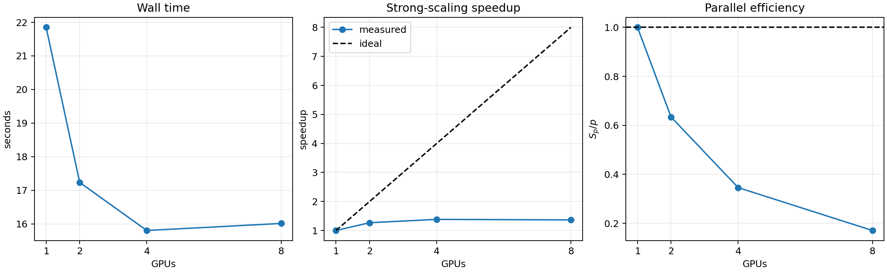

# 案例三：基于 PDEBench 的三维可压缩湍流生成与多 GPU 并行优化

> **案例性质**：本案例调用固定提交中原有的 `CFD_multi_Hydra.py` 生成三维数值解，不训练神经网络，因此没有 epoch 或 loss 曲线。重点是三维可压缩流的物理解释、PDEBench 数据生成和样本级多 GPU 强扩展。

本案例已在 8 张 NVIDIA GeForce RTX 3090 上完整复现。正式任务生成 8 个样本、11 个时刻、$64^3$ 网格以及密度、三分量速度和压力共 5 个场；大体积结果写入 `/home/ubuntu/data`，案例目录只保存配置、代码、文档和压缩后的展示图。

案例同时提供单 CPU 默认复现路径：`cpu.yaml` 使用一个 CPU 设备生成 `1×3×32³` 的五场数据，跳过多 GPU 基准，但保留数值生成、HDF5、全部物理后处理、PNG/GIF 和自动验收。多 GPU 内容作为独立案例中的性能扩展保留。

# 1. 案例描述

## 1.1 控制方程和物理量

本案例求解可压缩流体的质量、动量和总能量方程：

$$
\frac{\partial \rho}{\partial t}+\nabla\cdot(\rho\mathbf{v})=0,
$$

$$
\rho\left(\frac{\partial\mathbf{v}}{\partial t}+\mathbf{v}\cdot\nabla\mathbf{v}\right)
=-\nabla p+\eta\nabla^2\mathbf{v}
+\left(\zeta+\frac{\eta}{3}\right)\nabla(\nabla\cdot\mathbf{v}),
$$

$$
\frac{\partial}{\partial t}\left(\epsilon+\frac{\rho|\mathbf{v}|^2}{2}\right)
+\nabla\cdot\left[\left(\epsilon+p+\frac{\rho|\mathbf{v}|^2}{2}\right)\mathbf{v}
-\mathbf{v}\cdot\boldsymbol{\sigma}'\right]=0,
$$

其中：

- $\rho$：质量密度；
- $\mathbf{v}=(v_x,v_y,v_z)$：三维速度；
- $p$：气体压力；
- $\epsilon=p/(\gamma-1)$：单位体积内能；
- $\gamma=5/3$：绝热指数；
- $\eta,\zeta$：剪切与体黏性系数。

默认采用 $\eta=\zeta=10^{-8}$，接近无黏极限；初始马赫数为 $M_0=1$，所以压缩效应不能忽略。周期边界意味着物质不会从计算域流出，适合检验总质量和总能量。

## 1.2 湍流初值

初始密度和压力均匀，速度由有限个随机傅里叶模态叠加：

$$
\mathbf{v}(\mathbf{x},0)=\sum_i \mathbf{A}_i
\sin(\mathbf{k}_i\cdot\mathbf{x}+\boldsymbol{\phi}_i).
$$

PDEBench 随后在傅里叶空间执行 Helmholtz 分解，减去速度场的可压缩分量，使初始场以近似无散旋转运动为主；速度再归一化到指定马赫数。不同 `init_key` 产生不同相位，因此多个样本遵循相同方程和统计设置，但涡结构位置不同。

## 1.3 数值离散

PDEBench 求解器采用：

- 无黏通量：二阶 HLLC Riemann 求解器；
- 空间重构：MUSCL 与斜率限制器；
- 时间推进：预测—校正形式的二阶更新；
- 黏性项：中心差分；
- 时间步：由三维 CFL 条件自适应确定；
- 边界：两层 ghost cell 的三维周期边界。

HLLC 能区分左行波、接触波和右行波；MUSCL 在保持激波附近稳定的同时，降低一阶迎风格式对涡结构的过度抹平。代码入口保持为上游文件：

- [多样本三维求解器](https://github.com/pdebench/PDEBench/blob/4ff3e3a4aa1561721b5571fa3a048a0a463e0568/pdebench/data_gen/data_gen_NLE/CompressibleFluid/CFD_multi_Hydra.py)
- [三维湍流官方配置](https://github.com/pdebench/PDEBench/blob/4ff3e3a4aa1561721b5571fa3a048a0a463e0568/pdebench/data_gen/data_gen_NLE/CompressibleFluid/config/args/3D_Multi_TurbM1.yaml)
- [非线性方程公共算子](https://github.com/pdebench/PDEBench/blob/4ff3e3a4aa1561721b5571fa3a048a0a463e0568/pdebench/data_gen/data_gen_NLE/utils.py)

# 2. 前处理

## 2.1 创建 CPU 环境（默认复现）

CPU 环境不需要 NVIDIA 驱动或 CUDA：

```bash
git clone https://github.com/shenyun114/pdebench_case.git
cd pdebench_case/03_3d_compressible_turbulence
export PDEBENCH_CASE_DATA=/home/ubuntu/data  # 可替换为本机数据盘
export PDEBENCH_ROOT="$PDEBENCH_CASE_DATA/pdebench-upstream/PDEBench"
mkdir -p "$PDEBENCH_CASE_DATA/pdebench-case-envs"
conda env create \
  --prefix "$PDEBENCH_CASE_DATA/pdebench-case-envs/cfd3d-cpu" \
  -f environment-cpu.yml
conda activate "$PDEBENCH_CASE_DATA/pdebench-case-envs/cfd3d-cpu"
```

检查 CPU 后端、自动下载的 PDEBench 提交和工作树：

```bash
bash scripts/setup_workspace.sh \
  "$PDEBENCH_CASE_DATA/pdebench-cfd3d-cpu-check" \
  configs/cpu.yaml
```

成功输出应包含 `JAX 0.4.38 backend cpu`、一个 `CpuDevice` 和固定提交 `4ff3e3a4...`。

## 2.2 创建 CUDA JAX 环境（性能扩展）

环境约需数 GB，必须放到数据盘：

```bash
git clone https://github.com/shenyun114/pdebench_case.git
cd pdebench_case/03_3d_compressible_turbulence
export PDEBENCH_CASE_DATA=/home/ubuntu/data  # 可替换为本机数据盘
export PDEBENCH_ROOT="$PDEBENCH_CASE_DATA/pdebench-upstream/PDEBench"
mkdir -p "$PDEBENCH_CASE_DATA/pdebench-case-envs"
conda env create \
  --prefix "$PDEBENCH_CASE_DATA/pdebench-case-envs/cfd3d" \
  -f environment.yml
conda activate "$PDEBENCH_CASE_DATA/pdebench-case-envs/cfd3d"
```

本机驱动为 570.153.02，CUDA Driver API 显示 12.8。案例使用 `jax[cuda12]==0.4.38` 的自带 CUDA 运行库；要求 NVIDIA driver 不低于 525。PDEBench 原始 `pyproject.toml` 固定的是较早的 CUDA 11/JAX 0.4.11，本案例没有修改它，而是在独立环境中采用适合当前驱动的版本。

检查环境、8 张 GPU、源码提交和工作树：

```bash
bash scripts/setup_workspace.sh \
  "$PDEBENCH_CASE_DATA/pdebench-cfd3d-check" \
  configs/default.yaml
```

成功输出必须包括：

```text
JAX 0.4.38 backend gpu
GPU devices 8 [...]
PDEBench 4ff3e3a4aa1561721b5571fa3a048a0a463e0568（干净）
```

## 2.3 配置分档

| 配置 | 数据任务 | 性能任务 | 用途 |
|---|---|---|---|
| `cpu.yaml` | $1\times3\times32^3$ | 关闭 | 单 CPU 默认完整复现 |
| `smoke.yaml` | $8\times3\times32^3$ | $24^3$，1/2/4/8 GPU，各 1 次 | 快速检查全部阶段 |
| `default.yaml` | $8\times11\times64^3$ | $48^3$，每组预热 1 次、计量 2 次 | 正式文档结果 |
| `highres_128.yaml` | $8\times21\times128^3$ | 默认关闭 | 高分辨率扩展 |

五个场分别保存为 `density`、`velocity_x`、`velocity_y`、`velocity_z` 和 `pressure`，布局统一为：

```text
[sample, time, x, y, z]
```

## 2.4 前处理和兼容层

`run_official.py` 不复制求解器，而是进入上游 `CompressibleFluid` 目录，使用 Hydra 的 `++args.*` 覆盖分辨率、样本数、时间、随机种子和输出路径。实际命令完整记录在 `dataset_run.json` 和日志中。

固定提交的公共边界函数使用历史写法 `u.loc[index].set(...)`，现代 JAX 的等价接口为 `u.at[index].set(...)`。[`jax_loc_compat.py`](src/jax_loc_compat.py) 仅在进程运行时给 JAX tracer 增加 `loc -> at` 等价别名：

- 不改动脚本下载的 PDEBench 上游文件；
- 不改变索引、边界值或数值公式；
- `setup_workspace.sh` 要求上游 Git 工作树必须为空，否则直接退出。

上游还会生成比场数组多一个元素的 `t_coordinate.npy`。转换器以数值场实际时间维为准裁掉尾部多余坐标，并把这一操作写入 `dataset_info.json`，而不是静默产生长度不一致的 HDF5。

# 3. 并行优化与数值执行

## 3.1 `pmap(vmap(evolve))` 的准确含义

官方核心调用是：

```python
pm_evolve = jax.pmap(jax.vmap(evolve, axis_name="j"), axis_name="i")
```

其并行层次为：

```text
8 个独立样本
├── pmap：把样本组分到可见 GPU
│   ├── GPU 0：vmap(本卡样本)
│   ├── GPU 1：vmap(本卡样本)
│   └── ...
└── 每个 evolve 都持有完整的 x×y×z 网格
```

因此：

- 这是**样本级数据并行**；
- 单个样本没有沿 $x/y/z$ 做空间域分解；
- GPU 之间不交换单个样本的 halo；
- 样本数必须能被可见 GPU 数整除；
- 增加 GPU 会减少每卡样本数，但不能缩短单个样本的临界路径。

这与 MPI 网格分区的强扩展不是一回事。文档和性能图均使用“sample-level strong scaling”，不把它描述成三维空间并行。

## 3.2 一键 CPU 复现

```bash
export PDEBENCH_CASE_DATA=/home/ubuntu/data
export PDEBENCH_ROOT="$PDEBENCH_CASE_DATA/pdebench-upstream/PDEBench"
conda activate "$PDEBENCH_CASE_DATA/pdebench-case-envs/cfd3d-cpu"
cd "$(git rev-parse --show-toplevel)/03_3d_compressible_turbulence"

bash scripts/run_pipeline.sh \
  "$PDEBENCH_CASE_DATA/pdebench-cfd3d-cpu" \
  configs/cpu.yaml
```

本机在全新纯 CPU 环境中生成 `1×3×32×32×32` 的五个场，首次 JAX 编译、求解和 NPY 写盘为 `42.592 s`，HDF5 为 `1.45 MiB`；质量漂移为 `0`，总能量漂移为 `8.788×10⁻⁷`，全部物理图、GIF 和自动验收通过。墙钟时间会随 CPU 型号和共享负载变化。

## 3.3 CPU 分阶段运行

一键脚本适合完整复现；需要单独检查官方求解、数据转换或三维可视化时，可在同一个终端中依次执行以下三段命令。请为新实验指定新的 `WORK_ROOT`，避免覆盖已有 HDF5。

### 3.3.1 前处理

```bash
export PDEBENCH_CASE_DATA=/home/ubuntu/data
export PDEBENCH_ROOT="$PDEBENCH_CASE_DATA/pdebench-upstream/PDEBench"
conda activate "$PDEBENCH_CASE_DATA/pdebench-case-envs/cfd3d-cpu"
cd "$(git rev-parse --show-toplevel)/03_3d_compressible_turbulence"
export CASE_DIR="$PWD"
export WORK_ROOT="$PDEBENCH_CASE_DATA/pdebench-cfd3d-cpu-staged"
export ART="$WORK_ROOT/artifacts"
export CONFIG="$ART/resolved_config.yaml"
export JAX_PLATFORMS=cpu
export PYTHONPYCACHEPREFIX="$WORK_ROOT/python-cache"
export MPLCONFIGDIR="$WORK_ROOT/matplotlib-cache"

bash scripts/setup_workspace.sh "$WORK_ROOT" configs/cpu.yaml
cp configs/cpu.yaml "$CONFIG"
```

前处理由 [`scripts/setup_workspace.sh`](scripts/setup_workspace.sh) 完成：固定 PDEBench 提交、核验上游工作树、检查 JAX CPU 后端和依赖，并创建缓存与输出目录。`PDEBENCH_ROOT` 指定三个案例共用的源码位置，`WORK_ROOT` 指定本案例结果和缓存位置。[`configs/cpu.yaml`](configs/cpu.yaml) 定义 $32^3$ 网格、单样本、3 个输出时刻和关闭性能测试的 CPU 默认参数；[`src/jax_loc_compat.py`](src/jax_loc_compat.py) 在运行时兼容固定上游代码使用的旧版 JAX 更新接口，不修改 PDEBench 源文件。

### 3.3.2 算法运行

```bash
python "$CASE_DIR/src/run_official.py" \
  --config "$CONFIG" \
  --work-dir "$ART" \
  --mode dataset
```

[`src/run_official.py`](src/run_official.py) 将配置转换成 Hydra 覆盖参数，加载运行时兼容层并调用官方 `CFD_multi_Hydra.py`。该阶段输出 `$ART/raw_dataset/` 下的密度、三分量速度、压力与时间坐标 NPY 文件，以及 `$ART/dataset_run.json`；此时尚未合并 HDF5，也不生成图片。

### 3.3.3 后处理

```bash
python "$CASE_DIR/src/convert_dataset.py" \
  --config "$CONFIG" --work-dir "$ART"
python "$CASE_DIR/src/postprocess.py" \
  --config "$CONFIG" --work-dir "$ART"
python "$CASE_DIR/src/verify_results.py" \
  --config "$CONFIG" --work-dir "$ART"
```

后处理代码及职责如下：

| 代码 | 输入 | 输出与作用 |
|---|---|---|
| [`src/convert_dataset.py`](src/convert_dataset.py) | `raw_dataset/*.npy` 与配置 | 校验五场形状和时间坐标，生成 `cfd3d_dataset.h5` 与 `dataset_info.json` |
| [`src/common.py`](src/common.py) | HDF5 三维场 | 提供涡量、散度、守恒量和球壳能谱等公共计算 |
| [`src/postprocess.py`](src/postprocess.py) | HDF5 与配置 | 生成三正交切片、等值面、守恒诊断、能谱、GIF 和 `physical_metrics.json` |
| [`src/verify_results.py`](src/verify_results.py) | HDF5、指标和图像 | 检查五场、正密度/压力、守恒漂移、非零涡量和文件完整性，成功时输出 `PASS` |

仅调整等值面阈值、色标或物理诊断时，可以从 `postprocess.py` 开始重跑；原始 NPY 已存在而 HDF5 需要重建时，可以从 `convert_dataset.py` 开始。需要完整自动执行时，仍可使用 3.2 节的 [`scripts/run_pipeline.sh`](scripts/run_pipeline.sh)。

## 3.4 一键 GPU 快速测试

```bash
export PDEBENCH_CASE_DATA=/home/ubuntu/data
export PDEBENCH_ROOT="$PDEBENCH_CASE_DATA/pdebench-upstream/PDEBench"
conda activate "$PDEBENCH_CASE_DATA/pdebench-case-envs/cfd3d"
cd "$(git rev-parse --show-toplevel)/03_3d_compressible_turbulence"

bash scripts/run_pipeline.sh \
  "$PDEBENCH_CASE_DATA/pdebench-cfd3d-smoke-new" \
  configs/smoke.yaml
```

本机 smoke 复现得到 `8×3×32×32×32`，首次编译、计算和写盘为 `43.330 s`，最终自动验收 PASS。

## 3.5 一键 GPU 正式运行

```bash
export PDEBENCH_CASE_DATA=/home/ubuntu/data
export PDEBENCH_ROOT="$PDEBENCH_CASE_DATA/pdebench-upstream/PDEBench"
conda activate "$PDEBENCH_CASE_DATA/pdebench-case-envs/cfd3d"
cd "$(git rev-parse --show-toplevel)/03_3d_compressible_turbulence"

bash scripts/run_pipeline.sh \
  "$PDEBENCH_CASE_DATA/pdebench-cfd3d-formal-new" \
  configs/default.yaml
```

目标目录已有 `cfd3d_dataset.h5` 时脚本会退出，防止覆盖。需要重跑时应使用新的 `WORK_ROOT`。

流水线依次执行：

1. 调用未修改的 PDEBench 求解器生成五个 NPY 场；
2. 合并为带字段名和来源元数据的 HDF5；
3. 完成 1/2/4/8 GPU 固定总样本数测试；
4. 计算涡量、速度散度、守恒量和三维能谱；
5. 生成静态图、11 帧 GIF 和自动验收 JSON。

## 3.6 GPU 正式数据生成结果

| 项目 | 实测值 |
|---|---:|
| GPU | 8 × RTX 3090 24 GiB |
| 数据形状（每个场） | `8×11×64×64×64` |
| 场数量 | 5 |
| 官方求解 + NPY 写盘 | 61.862 s |
| 合并 HDF5 大小 | 363.65 MiB |
| HDF5 路径 | `/home/ubuntu/data/pdebench-cfd3d-formal/artifacts/cfd3d_dataset.h5` |

这里的 `61.862 s` 包含 Python 启动、JAX 编译、初值生成、时间推进、设备到主机传输和五个 NPY 文件写出，不能解释为纯算子时间。

## 3.7 1/2/4/8 GPU 实测

固定总工作量为 8 个样本、$48^3$、$t=0\to0.05$。每个 GPU 组先执行一次不计入统计的 warm-up，再对两次完整进程运行取中位数。计时仍包含启动、初值、求解、回传和 NPY 写出。

| GPU 数 | 每卡样本 | 中位时间/s | 加速比 | 并行效率 |
|---:|---:|---:|---:|---:|
| 1 | 8 | 21.850 | 1.000 | 1.000 |
| 2 | 4 | 17.233 | 1.268 | 0.634 |
| 4 | 2 | 15.804 | 1.383 | 0.346 |
| 8 | 1 | 16.013 | 1.365 | 0.171 |

4 GPU 是本任务的最优点；8 GPU 反而比 4 GPU 慢约 0.21 s。原因不是 8 张 GPU 没有工作，而是每卡只有一个 $48^3$ 样本：批量并行度下降后，进程启动、每设备调度、主机回传和串行文件写出占比增大。这个结果说明“GPU 越多越快”只在计算粒度足够大时成立。



# 4. 后处理与物理分析

## 4.1 输出结构和验收

```text
artifacts/
├── resolved_config.yaml
├── pipeline.log
├── dataset_run.json
├── dataset_info.json
├── cfd3d_dataset.h5
├── raw_dataset/                 # PDEBench 原始五场 NPY
├── benchmark/
│   ├── benchmark.csv
│   └── benchmark_metrics.json
├── results/
│   ├── orthogonal_slices.png
│   ├── density_vorticity_isosurfaces.png
│   ├── conservation_and_flow_diagnostics.png
│   ├── kinetic_energy_spectrum.png
│   ├── multi_gpu_scaling.png
│   ├── turbulence_evolution.gif
│   └── physical_metrics.json
└── verification.json
```

自动验收检查：5 个字段、形状、有限值、正密度/压力、时间坐标、质量和能量漂移、非零涡量、1/2/4/8 GPU 组以及所有 PNG/GIF。正式结果为：

```text
PASS: official 3D CFD generation, multi-GPU benchmark and physical postprocessing are valid
```

## 4.2 密度、压力和速度的三正交切片

每一列分别截取 $x=L/2$、$y=L/2$ 和 $z=L/2$，因此不是同一张二维图重复三次。每行使用共同色标：

- **密度 $\rho$**：亮区是受压缩的高密度流体，暗区是膨胀形成的低密度区；终态范围为 `0.142–2.400`；
- **压力 $p$**：范围为 `0.038–3.415`，大部分高压结构与高密度结构相邻，符合可压缩流中压缩升压的直觉；
- **速度模 $|v|$**：展示局部动能强弱，其细长结构与密度峰不完全重合，因为高速平流、压缩和旋转是不同机制。

三个方向都出现连续结构，说明结果确实具有三维空间变化；只看一个中心切片可能漏掉与该平面不相交的涡结构。


## 4.3 密度与涡量等值面

左图取终态密度第 90 百分位等值面 $\rho=1.329$，表示最强的约 10% 压缩结构边界。它不是固体表面，而是三维标量场中具有相同密度的几何集合。

右图取涡量模第 97 百分位等值面 $|\boldsymbol\omega|=53.90$，其中

$$
\boldsymbol\omega=\nabla\times\mathbf{v}.
$$

涡量大表示速度方向在很短距离内强烈旋转。片状、弯曲和近似管状结构对应强剪切与涡旋区域；零散小片既来自真实小尺度结构，也受到 $64^3$ 网格和等值阈值的影响，不能把每个小片都解释为独立“大涡”。


## 4.4 质量、能量与压缩/旋转活动

四个面板分别回答不同问题：

1. **质量漂移**：周期域总质量保持为 1，终态相对漂移为 `0.0`；中间约 $10^{-7}$ 的锯齿来自 float32 求和舍入；
2. **动能与总能量**：动能从 `0.5904` 降到 `0.3120`，而总能量只漂移 `6.50×10⁻⁵`；
3. **平均压力**：从 `0.6000` 升到 `0.7856`，说明部分宏观运动转化为内能/压力；
4. **RMS 涡量和散度**：涡量衡量旋转，$\nabla\cdot\mathbf{v}$ 衡量压缩与膨胀。马赫数 1 下散度不能近似为零。

虽然物理黏性几乎为零，HLLC–MUSCL 仍有必要的数值耗散，因此动能下降不能全部归因于显式黏性。总能量接近守恒而动能下降、压力上升，是比单独查看某个场更完整的物理解释。


## 4.5 三维动能谱

对三个速度分量做三维 FFT，把具有相同整数波数半径的模态能量进行壳层求和，得到 $E(k)$。初始场只在低波数模态具有显著能量，这是有限个随机傅里叶模态构造初值的直接结果；到 $t=0.125$ 和 $0.25$，高波数出现连续能量，说明非线性平流产生了更小尺度结构。

图中的 $k^{-5/3}$ 只是 Kolmogorov 标度参考线。本案例时间短、网格只有 $64^3$、流动可压缩且尚未建立宽惯性区，因此不能仅凭局部斜率宣称已经获得充分发展的 Kolmogorov 湍流。


## 4.6 三维场时间动画

GIF 抽取中心 $x$ 平面，同时显示：

- 密度：压缩结构如何移动、合并和变形；
- 涡量模：旋转结构的增强、拉伸与衰减；
- 速度散度：正值为局部膨胀，负值为局部压缩。

三个面板在全部 11 帧中使用各自固定数值范围和同一张 GIF 全局调色板，色条位置、刻度及颜色映射均不随帧变化。因此不同时间的亮暗可以直接比较，而不是每一帧自动拉伸或重新量化后产生的假变化。


## 4.7 局限和扩展

- 多 GPU 是样本级并行，不是单样本空间域分解；若只有一个三维样本，增加 GPU 不会自动加速；
- 默认 $64^3$ 适合教学和流程验证，不足以解析很宽的湍流惯性区；
- `highres_128.yaml` 的内存、输出量和运行时间都会显著增加，应先完成 smoke/default；
- 当前性能数字只代表本机 8×RTX 3090、当前驱动、JAX 版本和数据盘状态，换机器后必须重跑；
- 若后续训练 FNO/U-Net，除 RMSE 外还应比较质量/能量漂移、涡量统计、散度统计和能谱误差。

## 4.8 参考资料

- [PDEBench 固定提交源码](https://github.com/pdebench/PDEBench/tree/4ff3e3a4aa1561721b5571fa3a048a0a463e0568)；
- Toro, *Riemann Solvers and Numerical Methods for Fluid Dynamics*（HLLC）；
- van Leer, *Towards the Ultimate Conservative Difference Scheme*（MUSCL）。
