# PDEBench 科学计算案例：二维浅水波、二维反应–扩散与三维可压缩湍流

## 1. PDEBench 概述

### 1.1 PDEBench 简介

PDEBench 是面向偏微分方程数值计算与科学机器学习的完整基准工具集。它把数据生成、标准数据读取、代理模型训练和结果评价放在统一代码库中，使同一类 PDE 问题能够沿着“求解控制方程—保存时空场—训练模型—评价结果”的流程使用。

PDEBench 的主要组成包括：

- `pdebench/data_gen`：生成不同 PDE 的数值解，包含一维、二维和三维问题的求解入口、初始条件及参数配置；
- `pdebench/data_download`：下载已经生成的标准数据；
- `pdebench/models`：提供 FNO、U-Net、PINN 等模型及其训练、推理和数据加载代码；
- 评价工具：计算 RMSE、归一化 RMSE、最大误差、守恒量误差、边界误差以及不同 Fourier 频段的误差。

PDEBench 仓库提供了多种物理问题的数据生成程序，包括但不限于浅水方程可以用来模拟水面波动和溃坝传播、反应–扩散方程可以模拟两个状态的相互作用与空间扩散、Navier–Stokes 方程可以模拟空气和水等流体的运动等。这些样例包括一维直线、二维平面和多维空间问题，可以用来生成具有不同空间结构和时间变化规律的数据。

PDEBench 数据通常按“样本—时间—空间—变量”组织。对于二维问题，一个物理量可以保存为 [sample,time,x,y]；对于三维问题则保存为 [sample,time,x,y,z]；涉及多物理量的问题可以分别保存关键的物理量。

### 1.2 本案例集对 PDEBench 的使用方式

基于 PDEBench，我们在这里实现了三个主要的案例，直接调用 PDEBench 已有求解实现生成真实数值场，重点展示其数值求解与数据生成能力。案例代码不直接修改 PDEBench 源代码中的控制方程、离散算子或数值通量，而是在其基础上增加了：用 YAML 集中管理网格、时间、物理参数和输出路径；把求解器输出整理为包含坐标与元数据的 HDF5；根据不同方程计算守恒量、传播特征、耦合机制和频谱；生成二维/三维静态图、时间演化 GIF 和机器可读验收结果。

三个案例分别使用 PDEBench 的不同求解程序完成数值模拟和分析：案例一模拟中心高水区释放后环形水波的传播；案例二模拟两个场在相互作用和扩散作用下，从杂乱的初始分布逐渐形成空间图案；案例三生成三维空间中的密度、速度和压力数据，并分析涡旋、局部压缩与膨胀以及不同大小的流动结构。三个案例从二维水面运动，逐步扩展到二维双场相互作用和三维流体运动，展示 PDEBench 生成和分析不同类型数值模拟数据的能力。

| 案例 | 案例内容 | 使用的 PDEBench 实现 | 完成任务 |
|---|---|---|---|
| 二维径向溃坝浅水波 | 撤去圆形挡板后，中心较深的水在重力作用下向四周流动：外侧形成一圈不断向外扩展的涌浪，中心区域则随着水体流出逐渐降低。 | `pdebench.data_gen.src.sim_radial_dam_break.RadialDamBreak2D`，以及其调用的 PyClaw Roe 浅水波求解器 | 记录每个时刻二维平面中的水深 $h$、两个方向的速度 $u,v$ 和动量 $hu,hv$。通过水深图、自由液面、速度箭头和 GIF 展示环形波的传播，并利用 Froude 数、质量、动量、机械能和三网格一致性评价计算结果。 |
| 二维耦合反应–扩散 | 两个随机初始场在局部反应与不同扩散速率作用下逐渐形成相关空间结构 | `pdebench.data_gen.src.sim_diff_react.Simulator`，包括五点稀疏 Laplace 算子和 SciPy RK45 时间积分 | 记录每个时刻二维平面中的激活场 $u$ 和恢复场 $v$。通过双场快照、反应与扩散强度、相图、空间频谱和 GIF 展示图案的形成过程，并利用场间相关性、图案特征尺度和三网格一致性评价计算结果。 |
| 三维可压缩湍流 | 随机 Fourier 速度初值在周期立方体内演化，形成同时包含旋转、压缩和膨胀的三维结构 | `pdebench/data_gen/data_gen_NLE/CompressibleFluid/CFD_multi_Hydra.py`、Hydra 三维湍流配置和 JAX 可压缩流求解器 | 记录每个时刻三维空间中的密度 $\rho$、三个方向的速度 $v_x,v_y,v_z$ 和压力 $p$。将五个物理场整理为 HDF5 数据，通过三个方向的中心切片、密度与涡量等值面和 GIF 展示流动结构，并利用质量、能量、速度散度和动能谱评价计算结果。 |

### 1.3 物理量阅读说明

下面介绍三个案例中使用的主要变量和诊断量，并说明它们在相应 PDEBench 方程及代码实现中的具体含义。需要注意，同一符号在不同案例中可能表示不同的量，应结合具体方程进行理解。

#### 浅水波物理量

| 符号或名称 | 含义 | 图像或数值如何理解 |
|---|---|---|
| $h$ | 水深，即自由液面到平坦底床的竖直距离 | $h$ 越大表示该位置水柱越高；它不是地形高度 |
| $u,v$ | 分别沿 $x,y$ 方向的深度平均流速 | 正负号表示流动方向，$\sqrt{u^2+v^2}$ 表示流速大小 |
| $hu,hv$ | 两个方向的单位宽度流量；水体密度取为 1 时也可理解为动量变量 | 同时包含水深和速度，是浅水方程直接推进的守恒量 |
| Froude 数 $Fr=\sqrt{u^2+v^2}/\sqrt{gh}$ | 流速与局部水面重力波传播速度之比 | $Fr<1$ 为亚临界，水面扰动可以向上下游传播；$Fr>1$ 为超临界 |
| 总水量（归一化总质量）$M=\int_\Omega h\,\mathrm dA$ | 对整个区域的水深做面积积分 | 没有水流出边界时应基本不变，可用于检查计算中是否出现非物理的水量增减 |
| 机械能 $E=\int_\Omega \left[h(u^2+v^2)/2+gh^2/2\right] \mathrm{d}A$ | 水体动能与重力势能之和 | 理想情况下应保持不变；数值算法为了稳定处理陡峭波前会进行轻微平滑，因此计算值可能缓慢下降 |

#### 反应–扩散物理量

| 符号或名称 | 含义 | 图像或数值如何理解 |
|---|---|---|
| $u$ | 激活场，是一个无量纲局部状态，不是流体速度 | 正负号和数值大小表示局部状态相对零值的方向和幅度；非线性项会限制其变化范围 |
| $v$ | 恢复场，与 $u$ 耦合且扩散更快 | 空间结构通常比 $u$ 更平滑，用于抑制或跟随激活场变化 |
| $D_u,D_v$ | 两个场的扩散系数 | 数值越大，场越快消除尖锐梯度；本案例 $D_v=5D_u$ |
| $R_u=u-u^3-k-v$ | 反应对 $u$ 的局部变化率 | $R_u>0$ 表示反应倾向于增大 $u$，$R_u<0$ 表示倾向于减小 $u$ |
| $R_v=u-v$ | 反应对 $v$ 的局部变化率 | 表示 $v$ 向 $u$ 的局部状态靠拢的方向和强度 |
| 场相关系数 | 衡量 $u,v$ 空间分布的一致程度 | 接近 1 表示两场高低区域大体重合，接近 0 表示没有明显线性对应 |
| 梯度能 $G=\langle |\nabla q|^2\rangle$ | 衡量场在空间中变化是否剧烈的粗糙度指标，不是守恒的物理能量 | 数值越大表示图案越粗糙、界面越多或越陡；下降表示扩散正在平滑小尺度结构 |
| 空间频谱 | 把场分解为不同空间频率，比较各种大小结构的强弱 | 低频对应大尺度结构，高频对应细小斑点和尖锐变化 |
| 特征尺度 | 根据空间频谱估算图案的典型尺寸 | 数值增大表示零散小结构逐渐合并为更宽、更大的区域 |

#### 三维可压缩流物理量

| 符号或名称 | 含义 | 图像或数值如何理解 |
|---|---|---|
| $\rho$ | 单位体积内的质量，即密度 | 高密度区通常对应流体被压缩，低密度区通常对应膨胀 |
| $v_x,v_y,v_z$ | 三个坐标方向的速度分量 | 三者共同构成速度向量，$|\mathbf v|$ 表示局部运动强度 |
| $p$ | 压力 | 压缩区通常压力升高；压力梯度会推动流体加速 |
| 内能密度 $e_{\mathrm{int}}=p/(\gamma-1)$ | 单位体积内由流体热力状态决定的内部能量 | 它不等同于流体整体运动产生的动能；压力升高通常伴随内能增加 |
| 动能密度 $e_{\mathrm{kin}}=\rho|\mathbf v|^2/2$ | 单位体积内由流体运动产生的能量 | 对整个区域积分可得到总动能；总动能下降而平均压力上升，表示部分运动能转化为内能或被数值耗散 |
| 总质量 $M=\int_\Omega \rho\,\mathrm dV$ | 对整个三维区域的密度做体积积分 | 周期边界下应基本不变，可用于检查计算是否出现非物理的质量增减 |
| 总能量 $E_{\mathrm{tot}}=\int_\Omega(e_{\mathrm{int}}+e_{\mathrm{kin}})\,\mathrm dV$ | 整个区域的内能与动能之和 | 理想情况下应基本守恒；其相对变化可用于评价三维求解过程的稳定性 |
| 涡量 $\boldsymbol\omega=\nabla\times\mathbf v$ | 速度场的局部旋转强度和旋转方向 | $|\boldsymbol\omega|$ 大的管状或片状区域表示强旋转和强剪切结构 |
| 速度散度 $\nabla\cdot\mathbf v$ | 衡量局部流体趋向膨胀还是收缩 | 负值表示局部趋向压缩，正值表示局部趋向膨胀，接近零表示局部体积变化较小 |
| 初始马赫数参数 $Ma$ | 初始流速与声速的比值，用于控制初始流动强度 | $Ma$ 接近或超过 1 时，密度和压力变化不能忽略；它不是本案例逐点计算的输出场 |
| 速度能谱 $E(k)$ | 将三个速度分量的 Fourier 能量按波数汇总，比较不同大小流动结构的强弱 | 小 $k$ 对应大尺度运动，大 $k$ 对应细小结构；当前实现未使用密度加权，因此更准确地反映速度波动的尺度分布 |

三个案例的代码可以从 Github 下载获取，DATA 路径可以根据本机环境自己配置，作为后续拉取代码、环境配置以及实验结果存放的目录。

```bash
git clone https://github.com/shenyun114/pdebench_case.git
cd pdebench_case
export PDEBENCH_CASE_DATA=/home/ubuntu/data  # 可替换为本机数据盘
export PDEBENCH_ROOT="$PDEBENCH_CASE_DATA/pdebench-upstream/PDEBench"
```

---

## 2. 案例一：二维径向溃坝浅水波

### 2.1 案例描述

浅水方程适用于水平方向的范围（如波长、河道长度）远大于水深，并且水面可以自由升高或降低的流动。这里的“浅水”是相对于水平范围而言，并不表示实际水深一定很小。在这种情况下，水体沿竖直方向的速度变化通常较小，因此可以不再逐层计算三维流动，而用水深和沿水深平均后的水平速度描述水体运动。海啸、洪水、溃坝、潮汐和城市内涝等大范围水面运动都可以在适当条件下采用这种模型。本案例在平坦底床上设置一个圆形高水区；撤去圆形挡板后，中心较深的水向四周流动，外侧形成不断向外扩展的环形波，中心水位则逐渐降低。

守恒变量为

$$
\mathbf{q}=(h,hu,hv)^{\mathrm T},
$$

其中 $h$ 为水深，$u,v$ 为两个水平方向的深度平均速度，$hu,hv$ 为单位宽度动量。守恒变量指的是数值求解器直接计算的变量，在没有外部输入输出和损失的情况下是保持不变的。无底床起伏和摩擦时，二维控制方程为

$$
\frac{\partial h}{\partial t}
+\frac{\partial(hu)}{\partial x}
+\frac{\partial(hv)}{\partial y}=0,
$$

$$
\frac{\partial(hu)}{\partial t}
+\frac{\partial}{\partial x}\left(hu^2+\frac12gh^2\right)
+\frac{\partial(huv)}{\partial y}=0,
$$

$$
\frac{\partial(hv)}{\partial t}
+\frac{\partial(huv)}{\partial x}
+\frac{\partial}{\partial y}\left(hv^2+\frac12gh^2\right)=0.
$$

第一个式子表达水体质量守恒，后面两个式子表达两个方向的动量守恒；$gh^2/2$ 是静水压力产生的通量。流动状态用 Froude 数

$$
Fr=\frac{\sqrt{u^2+v^2}}{\sqrt{gh}}
$$

判断：$Fr<1$ 为亚临界流，重力扰动能够双向传播；$Fr>1$ 为超临界流。径向溃坝同时包含初始间断、非线性波传播、守恒和轴对称性，是检验双曲守恒律求解器的典型问题，也能为洪水波前识别和快速代理模型提供结构清晰的时空数据。

### 2.2 前处理

计算区域是以 $(0,0)$ 为中心、边长为 5 的二维正方形，$x$ 和 $y$ 坐标都从 $-2.5$ 变化到 $2.5$。程序沿两个方向各均匀划分 128 份，得到 $128\times128$ 个网格单元，每个单元的边长为 $5/128=0.0390625$。网格越细，越能清楚表示水深波前，但计算量和输出文件也会增大。有限体积求解器在每个网格单元中保存水深 $h$ 和动量 $hu,hv$ 的平均值，而不是只保存网格节点上的点值。

初始时刻在区域中心设置半径为 0.5 的圆形高水区。圆内水深为 2，圆外水深为 1，所有位置的水最初都处于静止状态：

$$
h(x,y,0)=2\quad\text{当 }r\le0.5,
\qquad
h(x,y,0)=1\quad\text{当 }r>0.5,
$$

其中 $r=\sqrt{x^2+y^2}$，并且 $u(x,y,0)=v(x,y,0)=0$。

圆形边界不能与正方形网格完全重合，因此离散后的圆周会带有轻微的阶梯形状。这是圆形初值映射到笛卡尔网格后的正常现象，并不表示水面本身存在方形扰动。

计算区域四周采用外推边界，即用靠近边界的内部状态延伸到边界外的辅助网格，使向外传播的波尽量平稳离开计算区域。配置中取归一化重力加速度 $g=1$，并在 $t=0$ 到 $t=1$ 之间保存 101 个等间隔时刻，相邻输出帧的时间间隔为 0.01。这里的 0.01 只是结果保存间隔；求解器为了满足 CFL 稳定条件，会在两个输出时刻之间自动使用一个或多个更小的内部时间步。

本案例从官方求解器状态中同时提取 $h,u,v,hu,hv$，并写入带 $x,y,t$ 坐标和参数元数据的 HDF5。这样既保留训练数据常用的水深场，也能在后处理中计算动量、机械能、速度与 Froude 数。首次运行需要创建一次浅水波环境。对应的命令如下：

```bash
export PDEBENCH_CASE_DATA=/home/ubuntu/data
cd "$(git rev-parse --show-toplevel)"
mkdir -p "$PDEBENCH_CASE_DATA/conda-envs"
conda env create \
  --prefix "$PDEBENCH_CASE_DATA/conda-envs/pdebench-swe" \
  -f 01_radial_dam_break/environment.yml
```

环境创建完成后，执行下面的前处理命令。对应代码为 [`scripts/setup_workspace.sh`](01_radial_dam_break/scripts/setup_workspace.sh) 和 [`configs/default.yaml`](01_radial_dam_break/configs/default.yaml)。其中：

- `PDEBENCH_CASE_DATA` 指定环境和实验结果所在的数据盘；
- `PDEBENCH_ROOT` 指定三个案例共用的一份 PDEBench 官方源码；
- `WORK_ROOT` 指定本次浅水波实验的独立工作目录；
- `ART` 保存 HDF5、日志、配置和后处理结果；
- `CONFIG` 是本次实验实际使用的配置副本。

前处理脚本会在 `$PDEBENCH_ROOT` 不存在时自动下载完整 PDEBench，检出固定提交，并验证 PyClaw 浅水波求解器能够导入。该阶段只准备源码、目录和配置，不进行浅水波数值求解。前处理、算法运行和后处理应在同一个终端中依次执行，以便后续命令继续使用这些路径变量。

```bash
export PDEBENCH_CASE_DATA=/home/ubuntu/data
export PDEBENCH_ROOT="$PDEBENCH_CASE_DATA/pdebench-upstream/PDEBench"
conda activate "$PDEBENCH_CASE_DATA/conda-envs/pdebench-swe"
cd "$(git rev-parse --show-toplevel)/01_radial_dam_break"
export CASE_DIR="$PWD"
export WORK_ROOT="$PDEBENCH_CASE_DATA/pdebench-swe-staged"
export REPO="$PDEBENCH_ROOT"
export ART="$WORK_ROOT/artifacts"
export CONFIG="$ART/resolved_config.yaml"

bash scripts/setup_workspace.sh "$WORK_ROOT"
mkdir -p "$ART/results"
cp configs/default.yaml "$CONFIG"
```

### 2.3 算法设计与并行优化

PDEBench 的 `RadialDamBreak2D` 使用 Clawpack/PyClaw 有限体积波传播算法。该方法可以把每个网格单元看成一个小水箱，相邻单元之间的公共边界称为网格界面。水流经过界面时会把水量和动量从一个单元带到另一个单元，这种单位时间内穿过界面的传递量称为界面通量。

求解器根据界面两侧的水深和速度，分别计算 $x$ 和 $y$ 方向的数值通量，再用“原有守恒量减去流出量、加上流入量”的方式更新每个网格。离散更新可以写为：

$$
\mathbf{q}_{ij}^{n+1}=\mathbf{q}_{ij}^{n}
-\frac{\Delta t}{\Delta x}
(\widehat{\mathbf{F}}_{i+1/2,j}-\widehat{\mathbf{F}}_{i-1/2,j})
-\frac{\Delta t}{\Delta y}
(\widehat{\mathbf{G}}_{i,j+1/2}-\widehat{\mathbf{G}}_{i,j-1/2}).
$$

其中，$\widehat{\mathbf F}$ 和 $\widehat{\mathbf G}$ 分别表示穿过竖直界面和水平界面的水量、$x$ 方向动量及 $y$ 方向动量。两个相邻单元使用同一个界面通量：从一个单元流出的量，会以相反符号计入另一个单元，因此内部网格之间的传递不会凭空增加或减少总体水量和动量。

界面两侧的水深和速度可能存在明显差异，特别是在初始圆形挡板附近，不能简单使用某一侧的数值。PDEBench 调用 `shallow_roe_with_efix_2D` 估计不同水波的传播方向和速度；entropy fix 用于保证稀疏波的传播符合物理规律，MC TVD 限制器则减弱陡峭波前附近不真实的数值振荡。求解器还会根据 CFL 稳定条件自动调整内部时间步。

该 $128^2$ 任务的单次求解约为秒级，官方入口为单进程 PyClaw。本案例不对小网格进行形式化 MPI 拆分，也不报告不适用的并行加速比。计算优化体现在调用已编译的 Roe 内核、一次求解保存全部场、向量化后处理以及用 32²/64²/128² 三网格量化精度—成本关系。大批量生成不同坝高或半径样本时，各样本互不依赖，可进一步在任务层并行。

算法运行调用 [`src/simulate_shallow_water.py`](01_radial_dam_break/src/simulate_shallow_water.py) 和官方 PyClaw 求解器，生成浅水波数值场，输出 `radial_dam_break.h5` 和 `simulation_info.json`。

```bash
PYTHONPATH="$REPO" python "$CASE_DIR/src/simulate_shallow_water.py" \
  --output "$ART/radial_dam_break.h5" \
  --config "$CONFIG" \
  --repo "$REPO"
```

### 2.4 后处理与结果分析

后处理由 [`src/analyze_and_visualize.py`](01_radial_dam_break/src/analyze_and_visualize.py) 生成物理指标、PNG 和 GIF；[`src/resolution_study.py`](01_radial_dam_break/src/resolution_study.py) 完成三网格研究；[`src/verify_results.py`](01_radial_dam_break/src/verify_results.py) 检查字段、守恒量和图像是否齐全。已经完成算法运行后，执行：

```bash
python "$CASE_DIR/src/analyze_and_visualize.py" \
  --data "$ART/radial_dam_break.h5" \
  --output "$ART/results"
PYTHONPATH="$REPO" python "$CASE_DIR/src/resolution_study.py" \
  --reference-data "$ART/radial_dam_break.h5" \
  --config "$CONFIG" \
  --output "$ART/results"
python "$CASE_DIR/src/verify_results.py" \
  "$ART/radial_dam_break.h5" "$ART/results"
```

#### 2.4.1 水深和自由液面演化

第一张图从左到右给出 $t=0$、$t=0.10$、$t=0.25$、$t=0.50$、$t=1.00$ 五个时刻的水深。颜色越深表示水越深，五个面板共用同一色标，因此可以直接比较不同时刻的水深。白线分别连接水深为 1.05、1.20 和 1.40 的位置，用于观察不同高度的水面边界如何移动。

最左图是初始状态：中心圆形区域水深为 2，外部水深为 1。挡板撤去后，原来的圆形交界分成两个方向的变化：外侧形成环形波并不断向外扩展，内侧的水深降低区域逐渐向圆心发展。到 $t=0.50$ 时，原来的中心高水区已经变成明显的环带；到 $t=1.00$ 时，外侧主波前到达半径约 1.741 的位置，而更远处仍保持初始水深。早期白线略显方形，是圆形边界放到正方形网格上产生的轻微离散痕迹，并非新的物理波动。

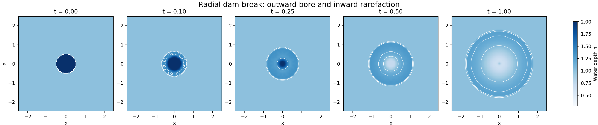

第二张图把水深画成三维水面：横向两个坐标表示平面位置，竖直高度和颜色都表示水深。左图中像圆柱一样的形状只是初始水面由深到浅的突然变化，不代表水中存在实体圆柱。中图可以看到中心高水区开始下降，水体在外侧堆成环形隆起；右图中中心进一步降低，环形隆起向外移动，直观显示了水体从中心向四周重新分布的过程。三维图适合观察整体水面形状，精确波前位置则应结合后面的径向剖面判断。

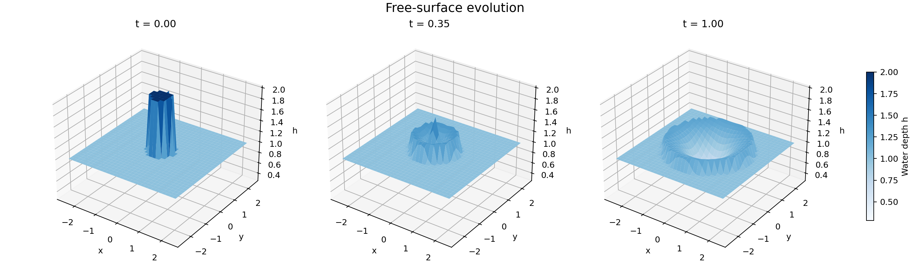

#### 2.4.2 速度、Froude 数与径向剖面

这张图的三列分别对应 $t=0.20$、$t=0.50$、$t=1.00$。上排颜色表示流速大小：颜色越亮，水流越快；白色箭头表示水流方向，箭头只在部分网格上绘制，以免相互遮挡。可以看到较快的水流最初集中在原挡板附近，随后形成向外移动并逐渐变宽的环带，箭头整体从中心指向四周。

下排显示 Froude 数，即流速与局部水面重力波速度的比值。它同时受流速和水深影响，所以分布与上排相似但不会完全相同。本案例最大流速为 0.5239，最大 Froude 数为 0.5275，始终小于 1，说明水流速度没有超过水面重力波的传播速度。末期中心附近出现少量向内箭头，是水面降低后的局部回调，不表示外侧主波开始反向传播。

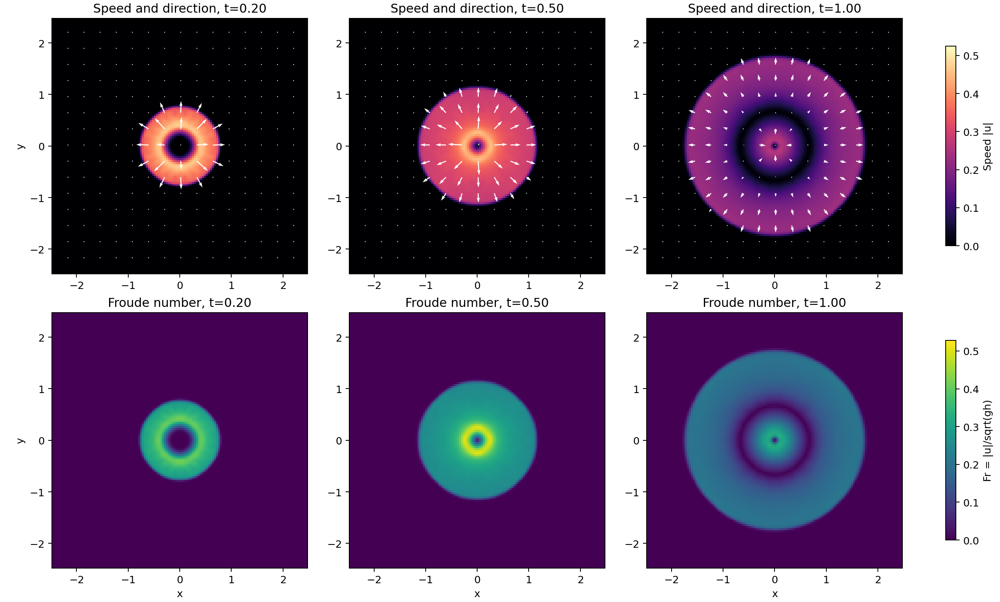

径向剖面把距离中心相同的一圈网格取平均，将二维环形波简化成随半径变化的一条曲线。左图是平均水深：曲线中向右移动的陡峭部分表示外侧波前，中心附近逐渐降低的平缓部分表示高水区正在回落。右图是平均径向速度：正值表示水向外流，负值表示水向中心流，接近零表示该半径处水流较弱。水深波前与向外速度变弱的位置基本对应，说明水深和速度记录的是同一圈向外传播的波。

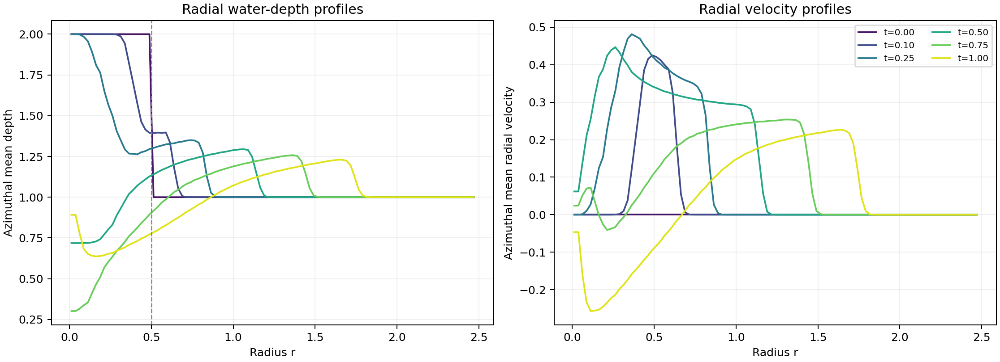

#### 2.4.3 守恒、耗散与网格一致性

守恒诊断图包含四个面板。左上图是总水量相对初始值的变化，曲线几乎贴着零线；总量从 25.79956055 变为 25.79956054，最大相对变化只有 $4.79\times10^{-10}$，说明计算过程中没有明显漏水。右上图是机械能变化，末时刻下降约 0.527%。在理想无摩擦条件下机械能应保持不变，但数值算法为了稳定处理陡峭波前会进行轻微平滑，因此会产生少量数值能量损失。

左下图是整个区域在 $x$ 和 $y$ 方向的总动量，两条曲线都接近零。这是因为水从中心向各个方向近似对称地流动，相反方向的动量相互抵消。右下图给出每个时刻的最大流速和最大 Froude 数，用于观察流动最强的位置随时间如何变化。结合四个面板可以判断：水量守恒良好，径向对称性得到保持，能量没有异常增加，并且水深始终为正。

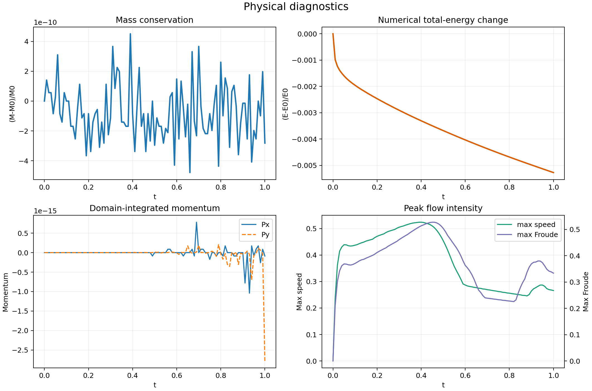

网格研究图比较 $32^2$、$64^2$、$128^2$ 三种分辨率。左图比较粗网格结果与 $128^2$ 结果的差异：网格从 $32^2$ 加密到 $64^2$ 后，相对 L2 差异由 2.015% 降至 1.202%，说明网格越细，结果越接近当前最细网格。中图显示运行时间随网格加密而增加，体现精度提高需要更多计算成本。右图显示三种网格的水量变化都远低于验收阈值，说明守恒表现没有因网格改变而失效。

$128^2$ 结果只是本次比较中的最细数值参考，并不是已知的精确答案。因此，这张图证明的是“网格加密后结果趋于一致”，不能理解成已经计算出相对于真实解析解的误差。由于初始水深和传播波前都比较陡峭，误差下降速度低于完全光滑问题也是正常现象。

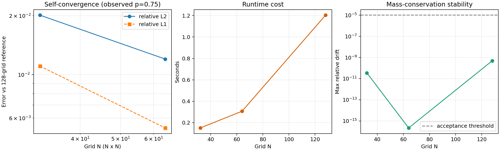

动画左侧显示水深，右侧用背景颜色显示流速大小、用箭头显示流动方向。水深和流速在整个动画中使用固定色标，因此同一种颜色在不同帧中始终表示同一个数值。播放时可以看到左侧水深波前与右侧较亮的速度环同步向外移动，说明水面变化和水流传播彼此对应。标题还给出当前时刻的总水量相对变化，该数值始终很小，说明整个动态过程中水量保持稳定。

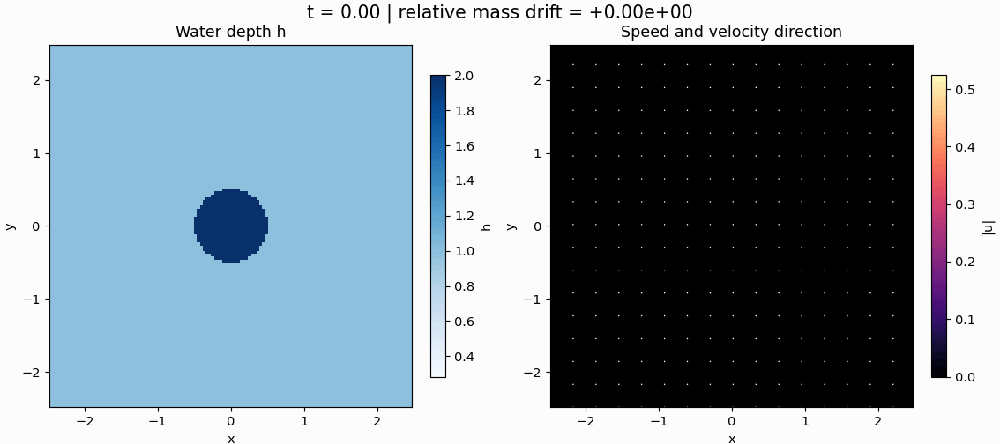

---

## 3. 案例二：二维耦合反应–扩散

### 3.1 案例描述

反应–扩散系统描述两种作用同时发生的过程：“反应”改变某个位置上的状态，“扩散”把局部差异向周围摊开。例如，化学物质可以在当地发生反应并向邻近区域扩散，生态种群也可能在当地增长或衰减并向周围迁移。这两种作用共同决定空间图案是被抹平，还是逐渐形成斑点、条纹或较大的连续区域。

PDEBench 的二维模型包含激活场 $u(x,y,t)$ 和恢复场 $v(x,y,t)$。它们是两个无量纲状态场，不特指某一种化学物质，也不是流体速度。两个场满足：

$$
\frac{\partial u}{\partial t}
=D_u\nabla^2u+u-u^3-k-v,
$$

$$
\frac{\partial v}{\partial t}
=D_v\nabla^2v+u-v.
$$

方程右侧的 $D_u\nabla^2u$ 和 $D_v\nabla^2v$ 表示扩散，作用是减小相邻位置之间的差异；其余部分表示局部反应，决定两个场在每个位置如何相互促进、抑制或跟随。本案例取 $D_u=10^{-3}$、$D_v=5\times10^{-3}$、$k=5\times10^{-3}$。由于 $v$ 的扩散系数是 $u$ 的 5 倍，它会更快消除细小起伏并形成更宽的空间结构；$u-u^3$ 中的负三次项则防止 $u$ 的幅值无限增大。

计算区域边界采用零法向通量条件，表示 $u$ 和 $v$ 不通过边界向外扩散。但局部反应仍可改变它们在整个区域中的平均值，所以本案例不要求 $u,v$ 的总量守恒，而是重点分析扩散与反应的强弱、两个场是否逐渐对应，以及图案是否由细小噪声发展成较大结构。

### 3.2 前处理

计算区域是一个边长为 2 的二维正方形，$x$ 和 $y$ 坐标都从 $-1$ 变化到 1。程序沿两个方向各均匀划分 128 份，得到 $128\times128$ 个网格单元，每个单元的边长为 $2/128=0.015625$。求解器根据零通量边界构造稀疏 Laplace 矩阵，使扩散只在区域内部重新分配状态，不会通过四周边界离开计算域。

随机种子 7 用于生成彼此独立的初始场 $u_0$ 和 $v_0$，所以初始图像表现为没有明显规律的随机噪声。固定随机种子可以让重复运行得到相同初值。随机场同时包含大尺度和细小变化，适合观察扩散优先消除小尺度噪声、反应逐渐建立有组织结构的过程。网格研究先生成同一份 $128^2$ 初值，再通过分块平均得到 $64^2$ 和 $32^2$ 初值，保证三种网格比较的是同一个空间分布，而不是三份不同的随机样本。

数值计算从 $t=0$ 推进到 $t=5$，共保存 101 个等间隔时刻，相邻输出帧间隔为 0.05。程序将两个 $128\times128$ 场展开并组合成求解器使用的状态向量，计算完成后再恢复为空间网格。HDF5 文件保存 $u,v$ 两个时空场、$x,y,t$ 坐标，以及扩散系数、反应参数、随机种子、边界和求解器信息。主要参数见[默认配置](02_reaction_diffusion/configs/default.yaml)。

首次运行需要创建一次反应–扩散环境。以下命令把 Conda 环境放在数据盘：

```bash
export PDEBENCH_CASE_DATA=/home/ubuntu/data
cd "$(git rev-parse --show-toplevel)"
mkdir -p "$PDEBENCH_CASE_DATA/conda-envs"
conda env create \
  --prefix "$PDEBENCH_CASE_DATA/conda-envs/pdebench-reacdiff" \
  -f 02_reaction_diffusion/environment.yml
```

环境创建完成后，执行下面的前处理命令。对应代码为 [`scripts/setup_workspace.sh`](02_reaction_diffusion/scripts/setup_workspace.sh) 和 [`configs/default.yaml`](02_reaction_diffusion/configs/default.yaml)。`PDEBENCH_ROOT` 指定三个案例共用的一份 PDEBench 官方源码，`WORK_ROOT` 指定本次反应–扩散实验的独立目录，`ART` 保存 HDF5、日志和图像，`CONFIG` 是本次实验实际使用的配置副本。脚本会自动下载并固定 PDEBench 提交、检查反应–扩散求解器是否可以导入，但此时不会开始数值积分。前处理、算法运行和后处理应在同一个终端中依次执行，以便继续使用这些路径变量。

```bash
export PDEBENCH_CASE_DATA=/home/ubuntu/data
export PDEBENCH_ROOT="$PDEBENCH_CASE_DATA/pdebench-upstream/PDEBench"
conda activate "$PDEBENCH_CASE_DATA/conda-envs/pdebench-reacdiff"
cd "$(git rev-parse --show-toplevel)/02_reaction_diffusion"
export CASE_DIR="$PWD"
export WORK_ROOT="$PDEBENCH_CASE_DATA/pdebench-reacdiff-staged"
export REPO="$PDEBENCH_ROOT"
export ART="$WORK_ROOT/artifacts"
export CONFIG="$ART/resolved_config.yaml"

bash scripts/setup_workspace.sh "$WORK_ROOT"
mkdir -p "$ART/results"
cp configs/default.yaml "$CONFIG"
```

### 3.3 算法设计与并行优化

扩散表示某个网格与上、下、左、右四个相邻网格之间的数值差异。PDEBench 使用五点差分计算这种差异：中心网格算一个点，四个直接相邻网格各算一个点，因此称为“五点格式”。以 $u$ 为例：

$$
(\nabla^2u)_{ij}\approx
\frac{u_{i+1,j}-2u_{ij}+u_{i-1,j}}{\Delta x^2}
+\frac{u_{i,j+1}-2u_{ij}+u_{i,j-1}}{\Delta y^2}.
$$

程序把所有网格上的五点计算组合成稀疏 Laplace 矩阵 $L$。所谓“稀疏”是指每个网格只与少数相邻网格有关，大部分矩阵元素都是零，因此不需要按完整大矩阵存储和计算。每次计算时间变化率时，程序先用 $L$ 得到扩散项，再加上局部反应项，最后同时更新 $u$ 和 $v$。

PDEBench 把空间离散后的系统交给 SciPy `solve_ivp` 中的 RK45 积分器。RK45 会比较不同阶近似的误差并自动调整内部时间步：变化快时使用较小步长，变化平缓时可以使用较大步长。文档中的 0.05 只是结果保存间隔，不是固定计算步长。网格越细，相邻点之间的扩散变化越敏感，积分器通常需要更多、更小的内部时间步。

本案例保持 PDEBench 的单进程求解流程，不虚构多核或多 GPU 加速结果。实际计算通过稀疏矩阵与 NumPy 数组运算一次处理整幅网格，避免逐点执行 Python 循环；$32^2$、$64^2$、$128^2$ 三网格实验用于展示分辨率提高带来的精度和时间成本变化。如果将来需要生成许多不同随机种子的样本，可以把互不依赖的样本分配给不同进程或计算节点，但这属于样本级并行，不是把一个二维网格拆开计算。

算法运行调用 [`src/simulate_reaction_diffusion.py`](02_reaction_diffusion/src/simulate_reaction_diffusion.py)、PDEBench 的反应–扩散离散与 RK45 时间积分，生成两个耦合场，输出 `reaction_diffusion.h5` 和 `simulation_info.json`。

```bash
PYTHONPATH="$REPO" python "$CASE_DIR/src/simulate_reaction_diffusion.py" \
  --output "$ART/reaction_diffusion.h5" \
  --config "$CONFIG" \
  --repo "$REPO"
```

### 3.4 后处理与结果分析

后处理由 [`src/analyze_and_visualize.py`](02_reaction_diffusion/src/analyze_and_visualize.py) 生成相图、反应/扩散强度、频谱、PNG 和 GIF；[`src/pdebench_operators.py`](02_reaction_diffusion/src/pdebench_operators.py) 复现上游离散算子；[`src/resolution_study.py`](02_reaction_diffusion/src/resolution_study.py) 和 [`src/verify_results.py`](02_reaction_diffusion/src/verify_results.py) 分别完成网格一致性与自动验收。已经完成算法运行后，执行：

```bash
python "$CASE_DIR/src/analyze_and_visualize.py" \
  --data "$ART/reaction_diffusion.h5" \
  --output "$ART/results"
PYTHONPATH="$REPO" python "$CASE_DIR/src/resolution_study.py" \
  --reference-data "$ART/reaction_diffusion.h5" \
  --config "$CONFIG" \
  --output "$ART/results"
python "$CASE_DIR/src/verify_results.py" \
  "$ART/reaction_diffusion.h5" "$ART/results"
```

#### 3.4.1 双场形成与耦合状态

第一张图从左到右给出 $t=0$、$t=0.25$、$t=1.00$、$t=2.50$、$t=5.00$ 五个时刻，上排是激活场 $u$，下排是恢复场 $v$。每一排在所有时刻使用同一色标，颜色的正负和深浅表示状态值的方向与大小。初始场是逐网格随机生成的，因此最左列看起来像杂乱噪声；初始值范围较大，部分颜色出现饱和是为了让后续幅值较小的结构仍然清晰可见。

随时间推进，扩散首先消除零散的小斑点，邻近的同类区域逐渐连成更宽的色块。由于 $v$ 的扩散系数是 $u$ 的 5 倍，下排比上排更早变平滑，形成的区域也更宽。两个场受到反应项耦合后，高值区和低值区的位置逐渐对应，但末时刻仍在缓慢变化，因此这张图表示图案正在形成，不能仅凭外观判断系统已经达到稳定状态。

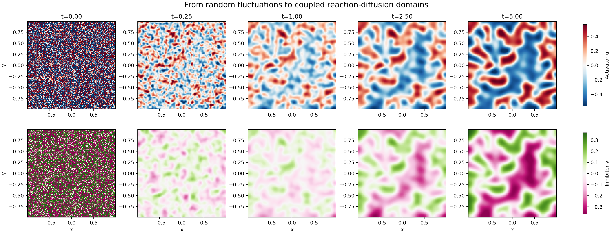

第二张图比较 $t=5$ 时的四个量。前两幅分别是 $u$ 和 $v$，用于直接比较两个场的最终空间分布；第三幅是差值 $u-v$，接近零的区域表示两场局部数值相近，正值或负值表示 $u$ 分别高于或低于 $v$。这个差值也是推动 $v$ 变化的局部反应项：正值使 $v$ 增大，负值使 $v$ 减小。第四幅是推动 $u$ 变化的局部反应项 $R_u$，正值表示反应倾向于增大 $u$，负值表示倾向于减小 $u$。后两幅图在末时刻仍有明显颜色分区，说明局部反应仍在发生，系统尚未完全平衡。

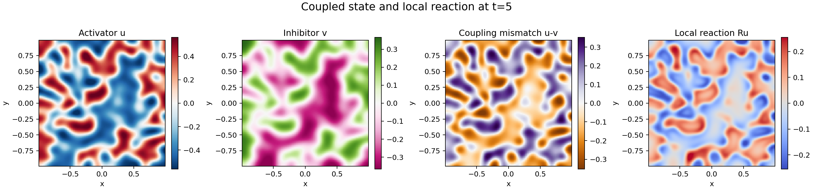

#### 3.4.2 相平面与机制平衡

相图不再显示网格位置，而是把每个抽样网格的 $u$ 放在横轴、$v$ 放在纵轴，因此一个点代表一个位置上的局部状态 $(u,v)$。不同颜色的点对应不同时间：初始时两场相互独立，散点分布很宽；随后扩散去除极端值，反应耦合使 $u$ 和 $v$ 越来越接近，散点逐渐收缩到对角线附近。

黑色曲线和橙色虚线表示在忽略扩散时，两个局部反应项分别等于零的位置，也就是反应在该方向上暂时不推动变量增减的状态。两条线的交点约为 $u=v=-0.171$，对应空间完全均匀时的反应平衡。紫色曲线表示整个区域的 $u,v$ 平均值随时间移动的路径；末端仍未到达交点，再次说明 $t=5$ 时系统尚未完全稳定。

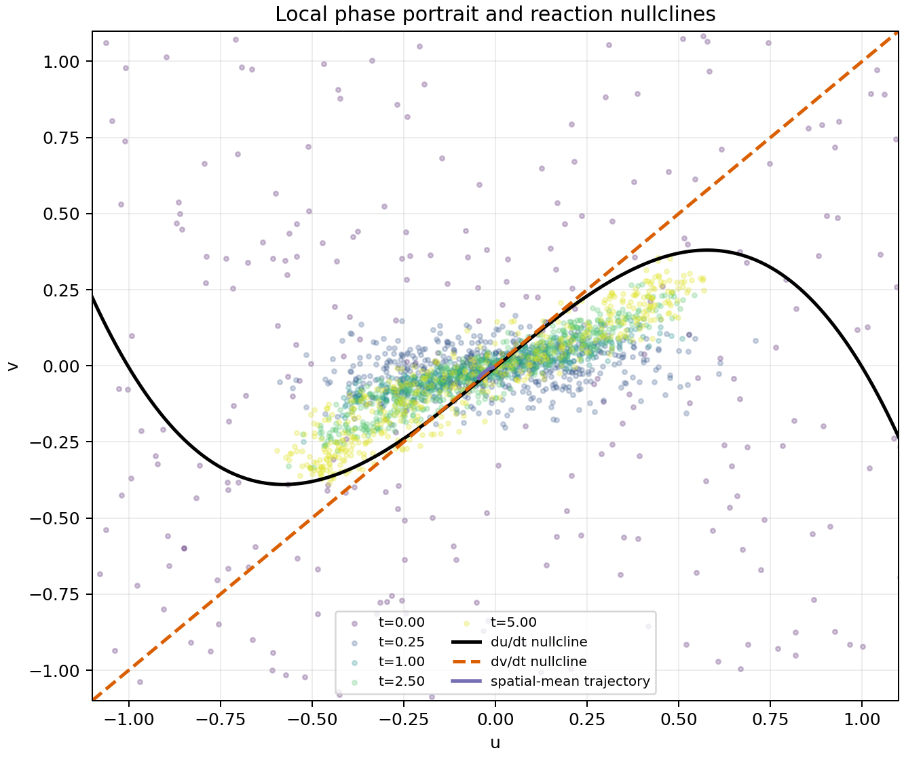

机制图包含四个面板。左上和右上分别比较 $u$、$v$ 方程中反应项与扩散项的 RMS；RMS 可以理解为该机制在整个区域中的平均作用强度，纵轴采用对数刻度。初始随机场相邻网格差异很大，所以扩散作用远强于反应作用，尤其是扩散更快的 $v$；噪声被平滑后，扩散强度迅速下降，并逐渐接近反应强度。

左下图给出两个场的空间平均值。平均值可以随时间改变，因为反应项会在局部生成或消减状态量，本问题不像浅水波那样要求 $u,v$ 总量守恒。右下图给出空间标准差，用来表示图案的明暗对比度：先下降说明扩散正在清除随机起伏，随后部分恢复说明非线性反应开始建立有组织的空间差异。

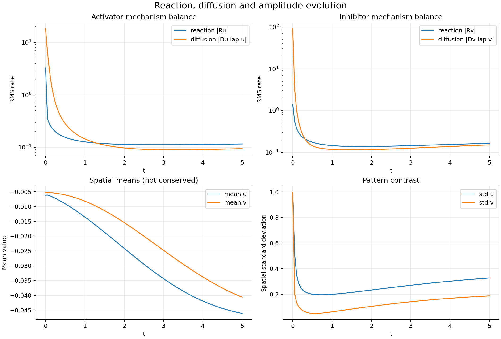

#### 3.4.3 粗糙度、相关性和频谱

图案诊断图也包含四个面板。左上图的梯度能衡量场在相邻位置变化得有多剧烈，它不是守恒的物理能量；$u$ 从 4228.26 降至 22.70，$v$ 从 4294.23 降至 3.88，表示最初粗糙的像素噪声已经变成平滑区域。右上图的相关系数由 0.0004 增至 0.9380；接近 0 表示初始两场没有明显线性对应，接近 1 表示末期两场的高低区域大体重合。

左下图是根据频谱估算的图案特征尺度，数值越大表示典型色块越宽。$u$ 的尺度从 0.0435 增至 0.5838，$v$ 从 0.0441 增至 0.8249，说明小斑点不断合并，并且扩散更快的 $v$ 形成了更宽的结构。右下图统计末时刻各数值出现的频率；$u$ 的分布更宽，说明慢扩散的激活场保留了更强的高低对比。

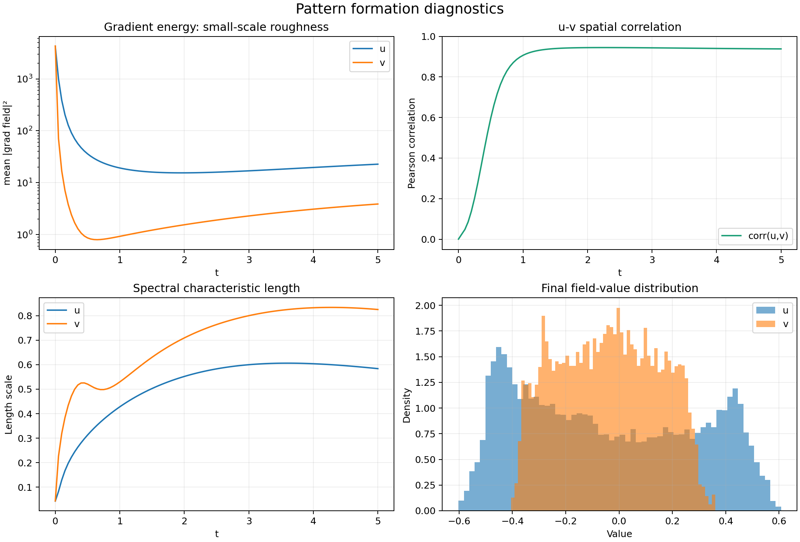

频谱图左侧对应 $u$，右侧对应 $v$；横轴是空间频率，越靠左表示越宽、越平缓的结构，越靠右表示越细小、变化越快的结构，纵轴表示相应结构在场中有多强。不同曲线代表不同时间。初始随机场同时包含大量高频和低频成分；随时间推进，右侧高频部分下降多个数量级，而低频部分相对保留，表示细小噪声正在消失、宽区域逐渐形成。$v$ 的高频部分下降得更早、更明显，与它具有更大扩散系数一致。

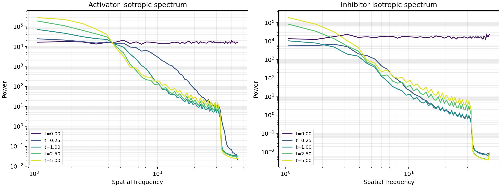

网格研究图比较 $32^2$、$64^2$、$128^2$ 三种分辨率，并让三种网格表示同一份投影初值。左图显示粗网格与 $128^2$ 结果的差异：从 $32^2$ 加密到 $64^2$ 后，$u$ 的相对 L2 差异由 36.08% 降至 13.55%，$v$ 由 24.24% 降至 9.76%，说明加密网格后结果更接近当前最细网格。中图显示分辨率越高，运行时间增长越明显。右图显示末时刻相关系数逐渐接近 $128^2$ 的 0.9380，说明主要耦合特征也在趋于一致。这里比较的是不同网格之间的一致性，$128^2$ 并不是已知的精确解。

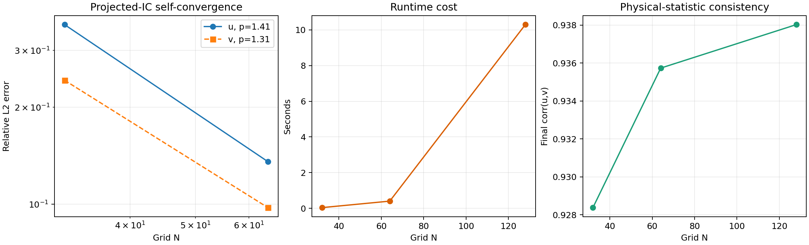

动画从左到右依次显示激活场 $u$、恢复场 $v$ 和推动 $u$ 增减的局部反应项 $R_u$。三个面板在全部帧中使用固定色标，因此同一种颜色始终对应同一个数值。播放时可以连续看到细小随机噪声被平滑、零散区域逐渐合并，以及 $u$ 和 $v$ 的空间位置越来越对应。标题中的相关系数同步从接近 0 增大到接近 1，为肉眼看到的“两场逐渐对齐”提供定量依据。

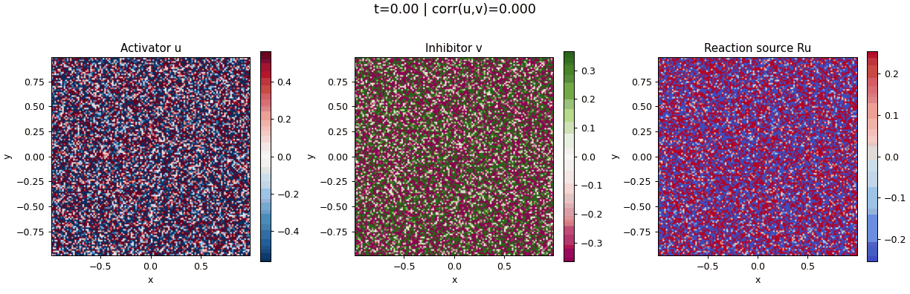

---

## 4. 案例三：三维可压缩湍流数值模拟

### 4.1 案例描述

普通低速液体常可近似认为密度不变，而可压缩流允许密度和压力随流动明显变化，因此能够描述高速气流、激波、燃烧流动和星际气体等现象。进入三维后，流体还可以在不同方向旋转、拉伸和相互挤压，逐渐形成大小不同的涡旋及压缩结构。本案例使用 PDEBench 的可压缩流求解器，生成密度、三个方向的速度和压力随三维空间及时间变化的数据。

求解器同时满足质量、三个方向的动量和总能量方程：

$$
\frac{\partial\rho}{\partial t}+\nabla\cdot(\rho\mathbf{v})=0,
$$

$$
\rho\left(\frac{\partial\mathbf{v}}{\partial t}
+\mathbf{v}\cdot\nabla\mathbf{v}\right)
=-\nabla p+\eta\nabla^2\mathbf{v}
+\left(\zeta+\frac{\eta}{3}\right)\nabla(\nabla\cdot\mathbf{v}),
$$

$$
\frac{\partial}{\partial t}\left(\epsilon+\frac12\rho|\mathbf{v}|^2\right)
+\nabla\cdot\left[
\left(p+\epsilon+\frac12\rho|\mathbf{v}|^2\right)\mathbf{v}
-\mathbf{v}\cdot\boldsymbol{\sigma}'
\right]=0.
$$

第一条方程表示质量只能随流体流入或流出而改变；第二条表示压力、惯性和黏性共同决定速度如何变化；第三条表示流体运动产生的动能与压力相关的内能之间可以相互转换，但整体总能量应基本守恒。其中 $\rho$ 是密度，$\mathbf{v}=(v_x,v_y,v_z)$ 是三维速度，$p$ 是压力，$\epsilon=p/(\gamma-1)$ 是单位体积内能，$\eta$ 和 $\zeta$ 表示两类黏性作用。

本例采用比热比 $\gamma=5/3$、近似为零但保留数值定义的黏性系数 $\eta=\zeta=10^{-8}$，并把初始马赫数设为 1。马赫数是流速与声速的比值，接近 1 表示密度和压力变化不能忽略。后处理还计算涡量、速度散度和速度能谱：涡量用于寻找旋转和剪切较强的位置，散度用于区分局部压缩与膨胀，速度能谱用于比较大尺度和小尺度流动结构的强弱。

### 4.2 前处理

计算区域是三个方向长度都为 1 的立方体。默认 CPU 配置把每个方向均匀划分为 32 份，得到 $32^3$ 个真实计算单元。求解器还在每个方向设置两层 ghost cell；它们是位于计算域外侧的辅助网格，用于方便计算边界附近的通量，不属于最终保存的物理区域。

初始密度和压力在整个立方体中相同，初始速度则由有限个随机 Fourier 模态叠加而成。可以把这些模态理解为方向、波长和相位不同的平滑三维波动；它们叠加后形成不规则但可重复的初始流动。官方程序进一步削弱初始速度中直接压缩或膨胀的部分，使初态主要表现为旋转运动，然后把整体速度调整到指定马赫数。固定随机种子 2022 可以保证重复运行使用相同的初始结构。

立方体采用周期边界：流体从一个表面离开后，会从相对的表面重新进入，相当于三个方向首尾相接。因此区域没有开放出口，适合检查总质量和总能量是否保持稳定。CPU 默认计算从 $t=0$ 推进到 $t=0.05$，保存 3 个时刻，生成 1 个样本的密度、$v_x,v_y,v_z$ 和压力共 5 个场。每个场按 `[sample,time,x,y,z]` 排列，随后由案例脚本把官方 NPY 文件合并成包含坐标、配置、源码提交和字段名的 HDF5，并检查五个场与时间坐标是否一致。

$32^3$ 配置用于普通 CPU 上验证完整流程。本文展示图采用已经验收的 $64^3$、11 时刻结果，以便更清楚地呈现三维结构；若只有 CPU，也可以提高配置分辨率获得同类结果，但所需内存和运行时间会明显增加。[128³ 配置](03_3d_compressible_turbulence/configs/highres_128.yaml)作为高分辨率扩展保留，不纳入默认复现。

首次运行需要创建一次三维 CFD 的 CPU 环境。以下命令把环境放在数据盘，不需要 NVIDIA 驱动或 CUDA：

```bash
export PDEBENCH_CASE_DATA=/home/ubuntu/data
cd "$(git rev-parse --show-toplevel)"
mkdir -p "$PDEBENCH_CASE_DATA/pdebench-case-envs"
conda env create \
  --prefix "$PDEBENCH_CASE_DATA/pdebench-case-envs/cfd3d-cpu" \
  -f 03_3d_compressible_turbulence/environment-cpu.yml
```

环境采用 `jax==0.4.38`。环境创建完成后，执行下面的前处理命令。对应代码为 [`scripts/setup_workspace.sh`](03_3d_compressible_turbulence/scripts/setup_workspace.sh)、[`configs/cpu.yaml`](03_3d_compressible_turbulence/configs/cpu.yaml) 和 [`src/jax_loc_compat.py`](03_3d_compressible_turbulence/src/jax_loc_compat.py)。`PDEBENCH_ROOT` 指定三个案例共用的官方源码，`WORK_ROOT` 指定本次三维实验目录，`ART` 保存原始数组、HDF5、日志和图像，`CONFIG` 是实际使用的 CPU 配置副本。JAX 和 Matplotlib 的缓存也写入 `WORK_ROOT`，避免占用个人目录。

前处理脚本会固定 PDEBench 提交、确认上游工作树没有修改、检查 JAX 确实使用 CPU 后端，并验证所需依赖。固定提交中的旧版 JAX 更新写法通过案例侧运行时兼容层适配，不会修改共享的 PDEBench 源文件。该阶段只准备环境、源码、配置和目录，不运行三维求解；三个阶段应在同一个终端中依次执行。

```bash
export PDEBENCH_CASE_DATA=/home/ubuntu/data
export PDEBENCH_ROOT="$PDEBENCH_CASE_DATA/pdebench-upstream/PDEBench"
conda activate "$PDEBENCH_CASE_DATA/pdebench-case-envs/cfd3d-cpu"
cd "$(git rev-parse --show-toplevel)/03_3d_compressible_turbulence"
export CASE_DIR="$PWD"
export WORK_ROOT="$PDEBENCH_CASE_DATA/pdebench-cfd3d-cpu-staged"
export ART="$WORK_ROOT/artifacts"
export CONFIG="$ART/resolved_config.yaml"
export JAX_PLATFORMS=cpu
export PYTHONPYCACHEPREFIX="$WORK_ROOT/python-cache"
export MPLCONFIGDIR="$WORK_ROOT/matplotlib-cache"

bash scripts/setup_workspace.sh "$WORK_ROOT" configs/cpu.yaml
cp configs/cpu.yaml "$CONFIG"
```

### 4.3 算法设计与计算优化

三维求解器同样采用有限体积思想，把立方体划分成许多小网格，并计算质量、三个方向的动量和总能量穿过六个网格面的传递量。相邻网格共用同一个界面通量，因此一个网格流出的量会进入旁边的网格，有助于保持整体质量和能量守恒。

界面两侧的密度、速度和压力可能差异很大。PDEBench 使用 HLLC Riemann 求解器估计不同流体波穿过界面的方向和速度，其中包括向两侧传播的压力波以及随流体移动的接触变化。MUSCL 方法利用邻近网格重建界面两侧状态，使平滑区域达到比简单常值近似更高的精度；斜率限制器则在陡峭变化附近减弱重建，避免出现不真实振荡。黏性项采用中心差分，时间方向使用二阶预测—校正更新，内部时间步由三维 CFL 稳定条件自动确定。

CPU 流程直接调用 PDEBench 的官方 JAX 求解器。JAX 首次执行时会先编译通量、重建和时间推进等数组运算，所以第一次运行包含明显的编译时间；编译完成后再执行实际计算。三维网格由整体数组表达式处理，不需要在 Python 中逐个遍历网格。默认配置只生成一个样本并关闭多 GPU 性能测试，使普通 CPU 也能完成数据生成、HDF5 转换、物理诊断、三维可视化、GIF 和自动验收。

算法运行调用 [`src/run_official.py`](03_3d_compressible_turbulence/src/run_official.py) 和固定版本 PDEBench 的三维 CFD 求解器，生成密度、三分量速度、压力和时间坐标等原始 NPY 文件。

```bash
python "$CASE_DIR/src/run_official.py" \
  --config "$CONFIG" \
  --work-dir "$ART" \
  --mode dataset
```

CPU 复现生成的每个场形状为 `1×3×32×32×32`，在全新纯 CPU 环境中，首次 JAX 编译、求解和五场 NPY 写盘合计 42.592 s，合并 HDF5 为 1.45 MiB。该时间包含 JAX 编译、初值、计算和 I/O，不等同于纯数值算子时间；换用其他 CPU 后墙钟时间会随核心性能和系统负载变化。

### 4.4 后处理与结果分析

后处理由 [`src/convert_dataset.py`](03_3d_compressible_turbulence/src/convert_dataset.py) 把原始 NPY 合并为 HDF5；[`src/postprocess.py`](03_3d_compressible_turbulence/src/postprocess.py) 计算涡量、散度、守恒量和动能谱，并生成切片、等值面和 GIF；[`src/verify_results.py`](03_3d_compressible_turbulence/src/verify_results.py) 完成自动验收。已经完成算法运行后，执行：

```bash
python "$CASE_DIR/src/convert_dataset.py" \
  --config "$CONFIG" --work-dir "$ART"
python "$CASE_DIR/src/postprocess.py" \
  --config "$CONFIG" --work-dir "$ART"
python "$CASE_DIR/src/verify_results.py" \
  --config "$CONFIG" --work-dir "$ART"
```

#### 4.4.1 三正交切片与三维等值面

三维数据无法在一张普通平面图中完整显示，因此第一张图从三个互相垂直的方向切开终态流场。三列依次是在立方体中心固定 $x$、固定 $y$ 和固定 $z$ 得到的截面，相当于从正面、侧面和顶面观察；它们不是同一张二维图的重复。三行依次显示密度、压力和速度大小，同一行共用相同色标，可以直接比较三个方向。

第一行颜色较亮的位置表示密度较高，较暗位置表示密度较低，终态密度范围为 0.142–2.400。第二行显示压力，范围为 0.038–3.415；高压区域通常靠近高密度区域，说明流体受到压缩时压力也随之升高。第三行显示速度大小，亮区表示运动较快。高速区不一定与最高密度区完全重合，因为快速平移、局部旋转和压缩会在不同位置发生。三个方向呈现出不同但彼此连续的结构，说明流场确实随 $x,y,z$ 三个方向变化，只看一个切面可能遗漏其他位置的结构。

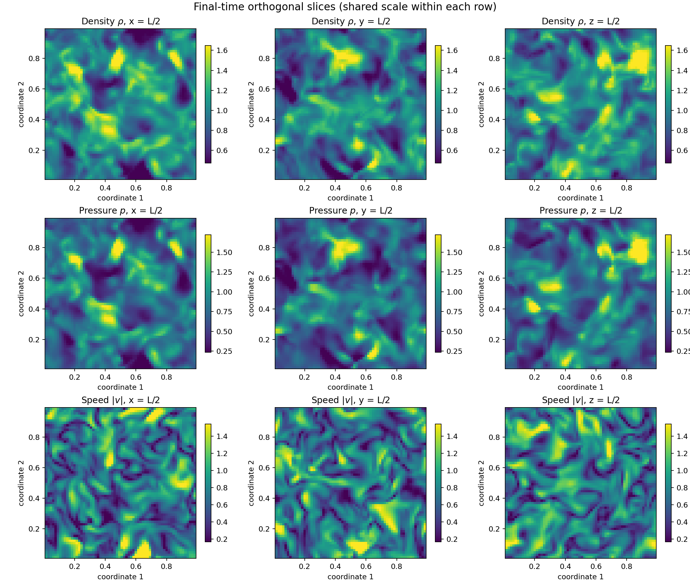

等值面把三维空间中数值相同的位置连接成表面，用来显示强结构在立方体中的形状和位置。左图选择密度第 90 百分位对应的 $\rho=1.329$，也就是重点显示密度最高约 10% 区域的外部轮廓；这些表面表示高密度压缩结构的边界，并不是计算域中的固体。右图选择涡量模第 97 百分位对应的 $|\boldsymbol\omega|=53.90$，主要保留旋转最强约 3% 的区域；弯曲、片状或管状表面表示强旋转和强剪切结构。

等值面的外观会随阈值改变：阈值降低会显示更多连片区域，阈值提高则只留下最强部分。因此图中的零散小片可能是真实小尺度结构，也可能受到 $64^3$ 网格分辨率和阈值选择影响，不能把每一小片都单独解释成一个完整的大涡旋。

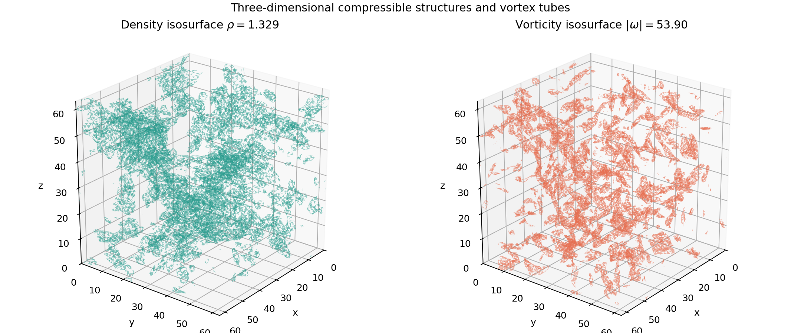

#### 4.4.2 守恒、能量转换和压缩性

物理诊断图包含四个面板。左上图是总质量相对初始值的变化，曲线始终接近零；总质量从 1 保持到 1，末时刻相对变化为 0，中间约 $10^{-7}$ 的微小波动主要来自单精度浮点数求和。这个结果说明周期边界下没有出现明显的质量丢失或增加。

右上图同时画出总动能和总能量。动能由 0.5904 降至 0.3120，表示整体运动逐渐减弱；总能量的相对变化只有 $6.50\times10^{-5}$，仍然近似守恒。左下图显示平均压力由 0.6000 升至 0.7856。三条结果应结合理解：部分运动能在压缩过程中转化为内能，数值算法为稳定处理陡峭结构也会产生少量耗散，所以动能下降的同时压力上升，而总能量仍基本稳定。

右下图比较 RMS 涡量和 RMS 速度散度。RMS 表示把整个区域的强弱综合成一个平均幅度；涡量反映旋转活动，速度散度反映压缩和膨胀活动。初始速度经过处理后接近无散，但马赫数约为 1 的三维非线性演化会产生密度波和明显的局部压缩、膨胀，因此速度散度不会始终为零。

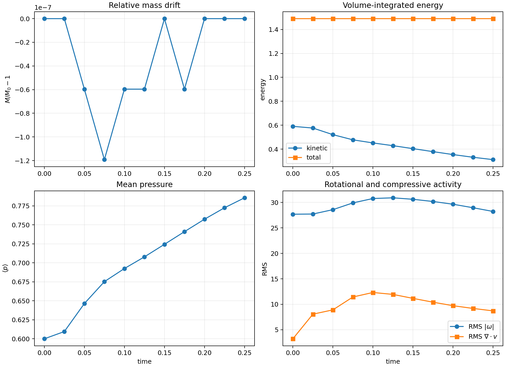

#### 4.4.3 三维动能谱与时间演化

速度能谱图把复杂的三维速度场按空间尺度进行汇总。横轴波数 $k$ 越小，代表越大、变化越缓慢的流动结构；$k$ 越大，代表越细小、变化越快的结构。纵轴 $E(k)$ 表示三个速度分量在相应尺度上的 Fourier 能量。当前实现没有乘密度，因此它更直接反映速度波动在不同尺度上的分布。

初始曲线主要集中在低波数，是因为初始速度只由有限个大尺度随机 Fourier 模态构成。到 $t=0.125$ 和 $t=0.25$，高波数区域逐渐出现连续的能量尾部，说明非线性流动产生了更细小的结构。图中的 $k^{-5/3}$ 虚线只用于比较曲线斜率，不表示结果必然满足 Kolmogorov 湍流理论。由于本案例计算时间短、分辨率只有 $64^3$，而且流动具有可压缩性，不能仅凭局部曲线接近虚线就判断已经形成充分发展的湍流惯性区。

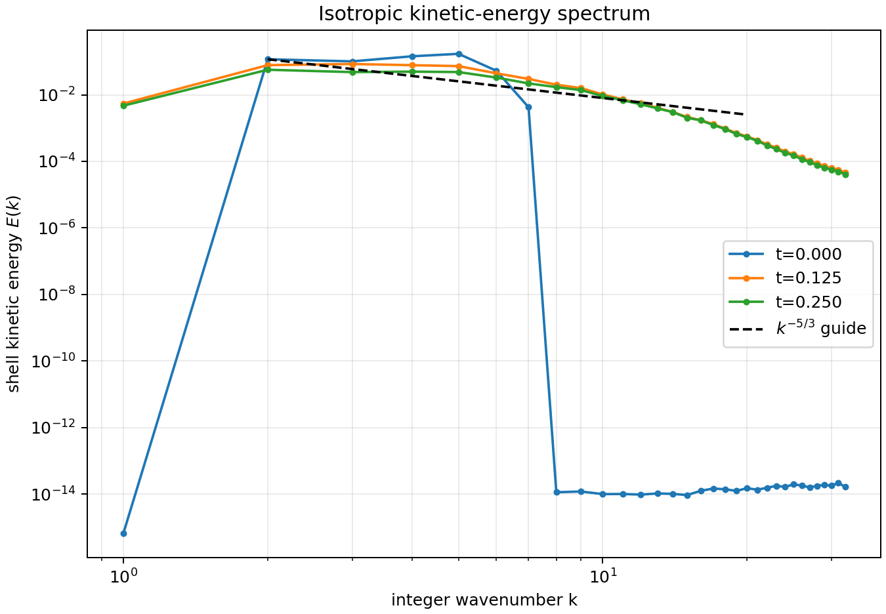

动画固定截取三维立方体中心的一个 $x$ 截面，相当于从侧面观察流场内部；图中的横轴和纵轴分别是 $y$、$z$ 方向的网格位置。三个面板从左到右同步显示同一截面、同一时刻的密度、涡量模和速度散度，因此可以把三种物理现象联系起来观察。

左图中的颜色表示密度 $\rho$。第一帧几乎是单一颜色，说明初始密度在空间中均匀；流动开始后逐渐出现高、低密度区域，表示流体受到挤压或膨胀后形成了不均匀结构。中图显示涡量模 $|\boldsymbol\omega|$，颜色越亮表示局部旋转或速度剪切越强。涡量模只有大小、没有正负，因此这幅图能够判断旋转活动的强弱，但不能直接判断旋转方向。右图显示速度散度 $\nabla\cdot\mathbf v$：蓝色负值表示流体向局部汇聚并受到压缩，红色正值表示流体从局部散开并发生膨胀，接近白色表示局部体积变化较弱。

播放动画时，可以看到密度结构不断移动和变形，强涡量区域发生拉伸、合并或减弱，同时压缩区和膨胀区也在改变位置。某一区域持续出现负散度时，流体不断向那里汇聚，随后通常可能形成较高密度；但密度是流动一段时间后累积形成的结果，因此高密度区与当前时刻的压缩区不一定完全重合。三个面板在全部 11 帧中都使用固定的数值范围、色条位置和颜色映射，所以同一种颜色在不同时刻始终代表同一个数值，动画中的颜色变化来自流场自身演化，而不是每一帧重新调整色标。需要注意，这里只显示中心截面，截面以外仍存在没有直接画出的三维结构。

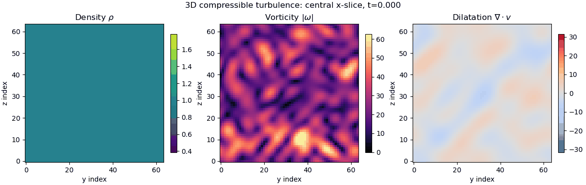
