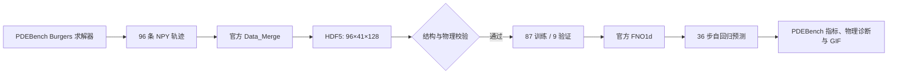
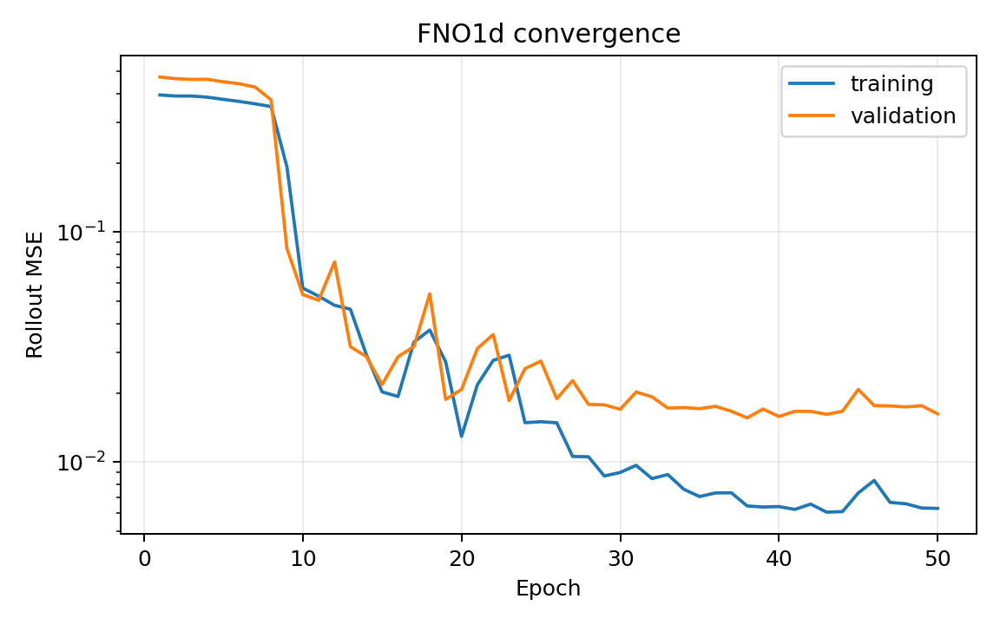
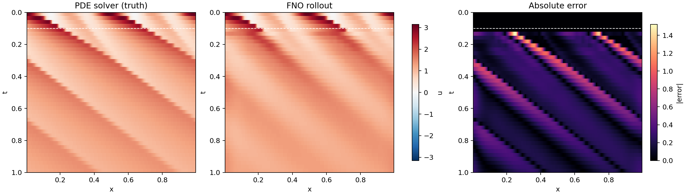
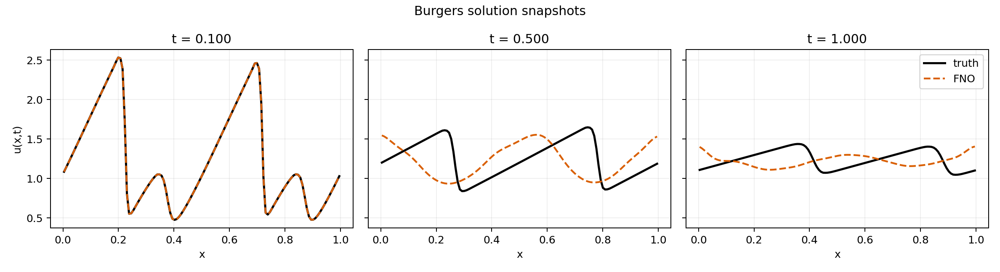
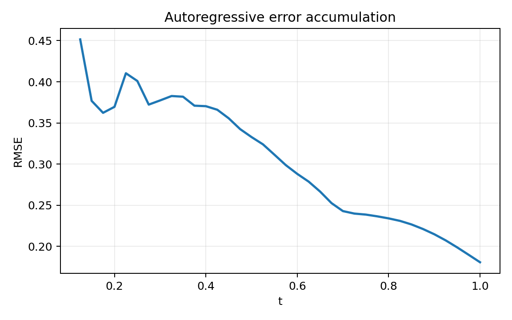
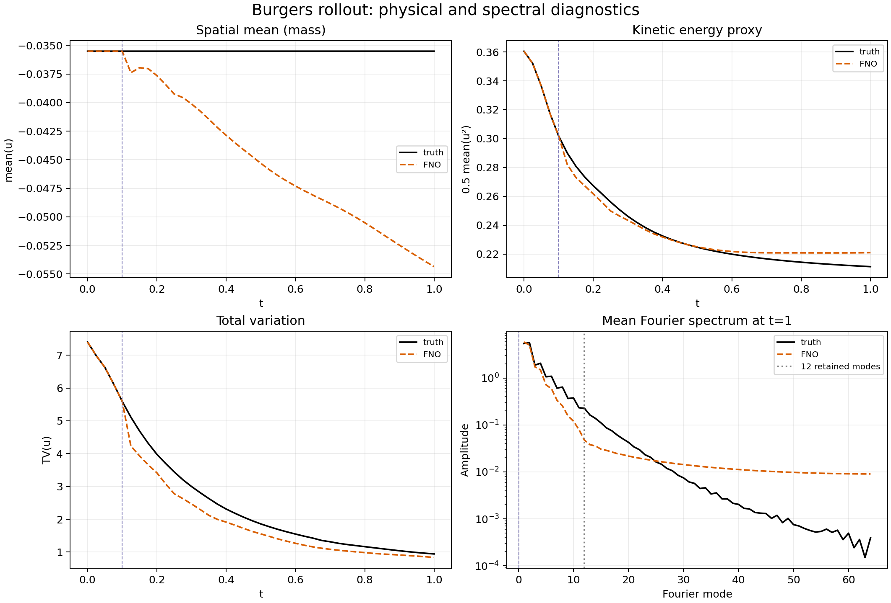
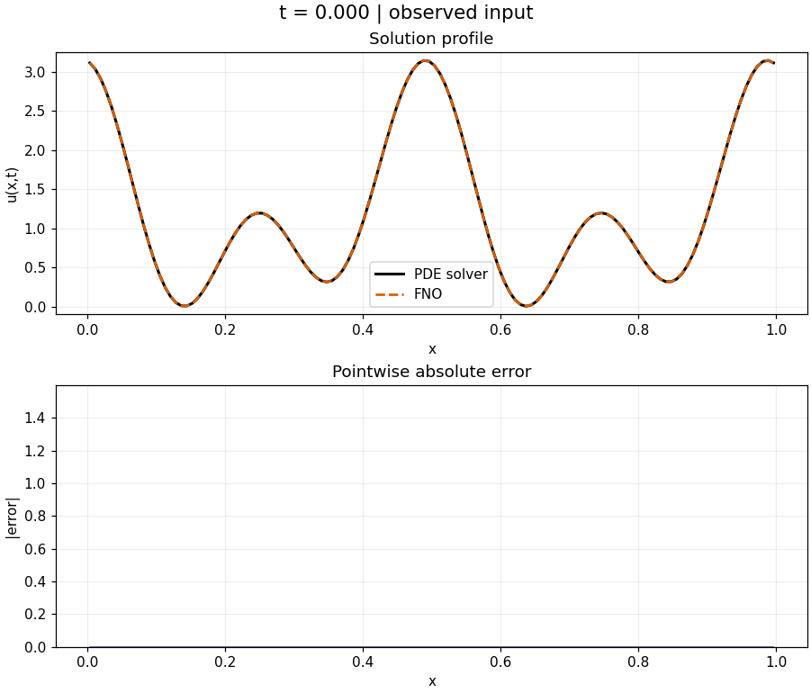

# 附录 B：用 FNO 预测一维黏性 Burgers 方程

本案例从零走通一条可复现的科学机器学习链路：使用 PDEBench 数值求解器生成 Burgers 方程轨迹，转换并校验官方 HDF5 数据，训练官方 `FNO1d`，进行 36 步自回归预测，计算 PDEBench 指标、物理量与频谱误差，并生成静态图和 GIF。

> 本案例固定 PDEBench 提交 `4ff3e3a4aa1561721b5571fa3a048a0a463e0568`。默认的 96 条轨迹是教学/流程验证规模，不是论文中的大规模基准；因此实测指标不能直接与论文表格比较。

## 1. 案例目标与选型

PDEBench 是面向科学机器学习的偏微分方程基准，提供数值数据生成器、标准数据格式、FNO/U-Net/PINN 基线和多种物理指标。本案例选择 Burgers 方程，是因为它同时包含：

- 非线性输运导致的波形陡化；
- 黏性扩散导致的能量耗散；
- 周期边界和守恒量，可用于验证生成数据；
- 长时间自回归预测，可直观看到误差传播；
- 一维问题计算量适中，单张消费级 GPU 数分钟即可跑通。

上游资料：[`pdebench/PDEBench`](https://github.com/pdebench/PDEBench)、[PDEBench 论文](https://proceedings.neurips.cc/paper_files/paper/2022/hash/0a9747136d411fb83f0cf81820d44afb-Abstract-Datasets_and_Benchmarks.html)。

## 2. 物理问题

一维黏性 Burgers 方程为

$$
\frac{\partial u}{\partial t}
+u\frac{\partial u}{\partial x}
=\nu\frac{\partial^2u}{\partial x^2},
\qquad x\in[0,1],\quad t\in[0,1],
$$

并采用周期边界 $u(0,t)=u(1,t)$。本案例设运动黏度 $\nu=0.01$，空间网格数 $N_x=128$，保存间隔 $\Delta t=0.025$，因此每条轨迹有 41 帧。

对周期边界积分可知，空间平均值（质量）应近似守恒：

$$
\frac{d}{dt}\int_0^1u\,dx=0.
$$

能量则因黏性耗散而不增：

$$
\frac{d}{dt}\frac12\int_0^1u^2\,dx
=-\nu\int_0^1\left(\frac{\partial u}{\partial x}\right)^2dx\leq0.
$$

`validate_data.py` 不仅检查形状、坐标和有限值，还自动检查这两个物理性质，避免“格式正确但数据错误”。

## 3. FNO 与自回归预测

傅里叶神经算子（Fourier Neural Operator, FNO）把场映射学习为频域积分算子。每层的核心形式可写为

$$
v_{l+1}(x)=\sigma\left(W_lv_l(x)+
\mathcal F^{-1}\left(R_l\cdot\mathcal F(v_l)\right)(x)\right),
$$

其中 $W_l$ 是局部线性变换，$\mathcal F$ 是 FFT，$R_l$ 只学习截断后的低频模态权重。本案例直接导入 PDEBench 的 `pdebench.models.fno.fno.FNO1d`，没有重写模型。

网络以最初 5 帧为滑动窗口预测第 6 帧，再把预测结果放回窗口，直到得到全部 41 帧。训练和验证都使用相同的 rollout 方式，因而损失能反映多步误差累积，而不是只反映单步拟合。



## 4. 目录结构

```text
appendix_burgers_fno/
├── README.md
├── environment.yml              # CUDA 11.7 / GPU 环境
├── environment-cpu.yml          # CPU 备用环境
├── patches/
│   └── pdebench-main-compat.patch
├── scripts/
│   ├── setup_workspace.sh       # 克隆、固定提交、兼容处理、安装
│   └── run_pipeline.sh          # 生成、合并、校验、训练、出图、验收
├── src/
│   ├── collect_system_info.py
│   ├── validate_data.py
│   ├── train_and_evaluate.py
│   ├── create_extra_visuals.py
│   └── verify_results.py
└── results/                      # 本机实测的轻量结果快照与 PNG
```

数据、模型和预测数组不放在个人目录中。默认工作区位于 `/home/ubuntu/data/pdebench-fno-demo`，完整运行约占十几 MB；仓库、原始数据与模型均留在数据盘。

## 5. 从零配置环境

### 5.1 前置条件

- Linux x86-64；
- Git；
- Miniconda/Anaconda；
- GPU 路径需要 NVIDIA 驱动支持 CUDA 11.7 运行时。`nvidia-smi` 能正常显示 GPU 即可，不要求系统安装完整 CUDA Toolkit；
- 建议至少 4 GB 可用磁盘、8 GB 内存。默认实验实际占用远低于此，余量用于 Conda 包和缓存。

检查硬件：

```bash
nvidia-smi
conda --version
git --version
```

### 5.2 GPU 环境（推荐）

```bash
git clone https://github.com/shenyun114/pdebench_case.git
cd pdebench_case/appendix_burgers_fno
conda env create -f environment.yml
conda activate pdebench-fno
```

如果同名环境已经存在，更新而不是重建：

```bash
conda env update -n pdebench-fno -f environment.yml --prune
conda activate pdebench-fno
```

验证 PyTorch 能看到 GPU：

```bash
python - <<'PY'
import torch
print("PyTorch:", torch.__version__)
print("CUDA runtime:", torch.version.cuda)
print("CUDA available:", torch.cuda.is_available())
print("GPU:", torch.cuda.get_device_name(0) if torch.cuda.is_available() else "CPU")
PY
```

预期关键输出为 `CUDA available: True`。本案例的数据生成使用 CPU 版 JAX，FNO 训练使用 CUDA；生成阶段出现 “CUDA-enabled jaxlib is not installed, falling back to cpu” 是预期提示，不影响结果。

### 5.3 无 NVIDIA GPU 的 CPU 环境

```bash
cd "$(git rev-parse --show-toplevel)/appendix_burgers_fno"
conda env create -f environment-cpu.yml
conda activate pdebench-fno-cpu
```

脚本会自动选择 CPU，不需修改代码。完整 50 轮会明显慢于 GPU；可先用下面的 10 轮命令检查流水线，但 10 轮结果只用于冒烟测试：

```bash
export PDEBENCH_EPOCHS=10
```

注意：自动验收的收敛阈值是按默认 50 轮设计的，10 轮运行可能在最后验收处报告未达阈值；这不代表数据生成失败。

## 6. 完整复现

以下命令从全新数据盘目录开始。不要复用已有 `artifacts/raw`，脚本会主动拒绝覆盖原始数据。

```bash
conda activate pdebench-fno
cd "$(git rev-parse --show-toplevel)/appendix_burgers_fno"

bash scripts/setup_workspace.sh /home/ubuntu/data/pdebench-fno-demo
bash scripts/run_pipeline.sh /home/ubuntu/data/pdebench-fno-demo
```

第一条脚本会完成：

1. 克隆 PDEBench；
2. checkout 到固定提交；
3. 应用三项上游兼容修正；
4. 将这份固定源码以 editable 方式安装到当前 Conda 环境；
5. 在数据盘创建产物目录。

三项兼容修正分别是：把旧 JAX `.loc` 更新为 `.at`；把 `Path.glob` 迭代器转换为可排序列表；修正时间坐标比解张量多一帧的问题。这些修改不改变 Burgers 离散格式或 FNO 结构。

第二条脚本依次执行：数据生成 → HDF5 合并 → 数据校验 → FNO 训练 → 指标计算 → PNG 出图 → 自动验收。成功结束时应看到：

```text
PASS: data, convergence, rollout and artifacts are valid
流水线完成。结果目录：.../artifacts/results
```

如需保留终端日志：

```bash
set -o pipefail
bash scripts/run_pipeline.sh /home/ubuntu/data/pdebench-fno-demo \
  2>&1 | tee /home/ubuntu/data/pdebench-fno-demo/pipeline.log
```

### 6.1 修改实验规模

默认值为 96 条轨迹、50 轮。可通过环境变量修改：

```bash
PDEBENCH_SAMPLES=192 PDEBENCH_EPOCHS=100 \
  bash scripts/run_pipeline.sh /home/ubuntu/data/pdebench-fno-demo-large
```

每次实验请使用新的工作区路径。训练/验证由 PDEBench `FNODatasetSingle` 按 90%/10% 切分；96 条轨迹对应 87 条训练、9 条验证。

## 7. 输出文件

完整输出位于 `<WORK_ROOT>/artifacts/`：

```text
artifacts/
├── raw/
│   ├── 1D_Burgers_Sols_Nu0.01.npy
│   ├── 1D_Burgers_Sols_Nu0.01.hdf5
│   ├── x_coordinate.npy
│   └── t_coordinate.npy
└── results/
    ├── best_fno1d.pt
    ├── predictions.npz
    ├── history.json
    ├── metrics.json
    ├── data_validation.json
    ├── system_info.json
    ├── training_curve.png
    ├── rollout_comparison.png
    ├── rollout_rmse.png
    ├── solution_snapshots.png
    ├── physics_diagnostics.png
    ├── physics_metrics.json
    └── burgers_truth_vs_fno.gif
```

可用下面的命令检查 HDF5：

```bash
python - <<'PY'
import h5py
p = "/home/ubuntu/data/pdebench-fno-demo/artifacts/raw/1D_Burgers_Sols_Nu0.01.hdf5"
with h5py.File(p) as f:
    print("keys:", sorted(f.keys()))
    print("tensor:", f["tensor"].shape, f["tensor"].dtype)
    print("Nu:", f.attrs["Nu"])
PY
```

## 8. 本机实测结果

验证日期：2026-08-06。硬件为 NVIDIA GeForce RTX 3090；Python 3.10.20，PyTorch 1.13.1+cu117，JAX/JAXLIB 0.4.38；固定提交与环境详见 [`results/system_info.json`](results/system_info.json)。独立验证工作区是 `/home/ubuntu/data/pdebench-fno-demo-verified`。

| 项目 | 实测值 |
|---|---:|
| 数据形状 | `96 × 41 × 128` |
| 训练 / 验证轨迹 | 87 / 9 |
| FNO 可训练参数 | 23,837 |
| GPU 训练与最终评估 | 153.42 s |
| 最佳轮次 | 38 / 50 |
| 最佳验证 rollout MSE | 0.0155689 |
| PDEBench RMSE | 0.0944092 |
| PDEBench normalized RMSE | 0.2004454 |
| 36 步最终 RMSE | 0.0875357 |
| 36 步最终 NRMSE | 0.1346568 |
| 最大质量漂移（真值） | $2.38\times10^{-7}$ |
| 能量最大正向增量（真值） | 0 |
| 预测全部有限 | 是 |

完整数值见 [`results/metrics.json`](results/metrics.json) 和 [`results/data_validation.json`](results/data_validation.json)。固定随机种子为 2026；不同 GPU/驱动的浮点规约顺序可能造成末位差异，验收使用合理阈值而不是逐位相等。

### 8.1 收敛曲线

训练 rollout MSE 从约 0.394 降至 0.00629，末轮约为首轮的 1.60%；验证误差在第 38 轮达到最低值。



### 8.2 时空场、预测与绝对误差

白色虚线是最后一个已知输入时刻 $t=0.1$，虚线以下均为自回归预测。FNO 能复现整体对流与耗散趋势，但在陡峭梯度附近出现更明显误差。



### 8.3 不同时刻的解剖面

初始 5 帧由真值提供，所以 $t=0.1$ 完全重合。随着 rollout 延长，单条较难验证轨迹的相位和高频结构逐渐偏离；这比只展示总体 RMSE 更直观地反映了小样本 FNO 的局限。



### 8.4 随预测时长累积的误差



### 8.5 质量、能量、总变差与频谱

空间平均值对应周期 Burgers 方程的守恒质量；$\frac12\langle u^2\rangle$ 表征黏性能量；总变差衡量间断和高梯度的强度；傅里叶谱则揭示不同尺度上的能量分布。紫色虚线是最后一个已知输入时刻。



真值质量最大漂移仅 `5.96×10⁻⁷`，但 FNO 在未来区间的平均绝对质量误差为 `0.02071`。末时刻能量相对误差为 `4.60%`，总变差相对误差为 `11.41%`。频谱图显示模型在截断模态附近过度衰减，同时在更高模态形成近似噪声底。这说明总体 RMSE 并不能替代守恒量和尺度分解诊断。

### 8.6 真值与 FNO 动态对比

上图逐帧比较解剖面，下图显示逐点绝对误差；前 5 帧是模型输入，之后进入自回归预测。



## 9. 如何理解这些结果

- 数据校验通过说明 PDEBench 数值解在离散容差内满足周期 Burgers 方程的质量守恒与黏性能量耗散。
- 训练曲线显著下降、验证曲线趋于平台，说明模型已学习到主要动力学，同时小数据集上继续训练的收益有限。
- 时空图能捕捉低频演化；误差主要集中在尖锐梯度和相位偏移处，符合截断傅里叶模态与自回归误差传播的特点。
- 本例的目标是验证“生成—训练—评估—可视化”链路。若用于模型比较，应扩大到官方数据规模，至少使用 3 个随机种子，并报告均值、标准差、显存和墙钟时间。

## 10. 常见问题

### `libstdc++.so.6` 或 `CXXABI` 报错

不要直接运行环境中的绝对 Python 路径；先激活 Conda，使动态库解析进入正确环境：

```bash
source "$(conda info --base)/etc/profile.d/conda.sh"
conda activate pdebench-fno
python -c "import matplotlib, torch; print('OK')"
```

### 提示 JAX 回退到 CPU

这是默认设计：CPU JAX 负责几秒级的数据生成，CUDA PyTorch 负责训练。只要 `metrics.json` 中 `runtime.device` 为 `cuda:0`，FNO 就在 GPU 上训练。

### 提示 `artifacts/raw` 已有数据

脚本为避免误覆盖而主动退出。换一个新的数据盘目录即可：

```bash
bash scripts/setup_workspace.sh /home/ubuntu/data/pdebench-fno-demo-02
bash scripts/run_pipeline.sh /home/ubuntu/data/pdebench-fno-demo-02
```

### 为什么不直接下载官方大数据集

完整官方数据适合论文级比较，但文件很大、下载时间长，也无法演示数值生成与物理校验。本例本地生成小数据集，更适合作为可重复教学案例。

## 11. 引用

如果在研究中使用 PDEBench，请引用其原论文：

```bibtex
@inproceedings{takamoto2022pdebench,
  title={PDEBench: An Extensive Benchmark for Scientific Machine Learning},
  author={Takamoto, Makoto and Praditia, Timothy and Leiteritz, Raphael and
          MacKinlay, Dan and Alesiani, Francesco and Pflueger, Dirk and
          Niepert, Mathias},
  booktitle={NeurIPS Datasets and Benchmarks Track},
  year={2022}
}
```
