# 附录 A：Gray–Scott 反应–扩散数据生成与样本级并行优化

> **案例性质**：这是受 PDEBench 数据生成工作流启发的独立 Gray–Scott 数值案例，不是 PDEBench 固定提交中已有的官方方程实现，也不训练神经网络。由于它与主案例二同属二维双场反应–扩散，现调整为扩展附录；其代码、结果和复现能力均保留。

本案例提供自包含的 Gray–Scott 求解和可视化实现，并增加 YAML 配置、一键流水线、重复性能测试、加速比/并行效率、机器可读指标和自动验收。大体积 HDF5 建议统一写入容量充足的数据盘。

# 1. 案例描述

## 1.1 Gray–Scott 模型

Gray–Scott 模型描述两种无量纲物质 $u(x,y,t)$ 和 $v(x,y,t)$ 的扩散、非线性反应、补给与消耗：

$$
\frac{\partial u}{\partial t}
=D_u\nabla^2u-uv^2+F(1-u),
$$

$$
\frac{\partial v}{\partial t}
=D_v\nabla^2v+uv^2-(F+k)v.
$$

- $D_u,D_v$：两种物质的扩散系数；
- $uv^2$：把 $u$ 转化为 $v$ 的自催化反应；
- $F(1-u)$：外界把 $u$ 补回背景浓度 1；
- $(F+k)v$：$v$ 的流出与消耗；
- $F,k$：决定斑点、环带、扩张结构或衰灭态的关键参数。

默认参数为 $D_u=0.16$、$D_v=0.08$、$F=0.060$、$k=0.062$、$\Delta t=1$。大部分区域从 $(u,v)=(1,0)$ 开始，中心矩形扰动设置为约 $(0.5,0.25)$ 并叠加小噪声。扰动提供反应“火种”，不同随机种子改变扰动位置和细节，从而形成同类但不完全相同的样本。

## 1.2 离散方法与数值单位

空间采用周期边界五点模板：

$$
L(a)_{i,j}=a_{i-1,j}+a_{i+1,j}+a_{i,j-1}+a_{i,j+1}-4a_{i,j}.
$$

时间采用显式 Euler：

$$
u^{n+1}=u^n+\Delta t[D_uL(u^n)-u^n(v^n)^2+F(1-u^n)],
$$

$$
v^{n+1}=v^n+\Delta t[D_vL(v^n)+u^n(v^n)^2-(F+k)v^n].
$$

这里沿用 Gray–Scott 文献和原案例常见的“格点单位”，即模板中 $\Delta x=\Delta y=1$ 已吸收到扩散系数里。`grid/x` 和 `grid/y` 是归一化展示坐标，不应再把模板除以 `1/nx²`。若需要有量纲模型，必须同时重新标定 $D_u,D_v,\Delta x,\Delta t$ 和稳定性条件。

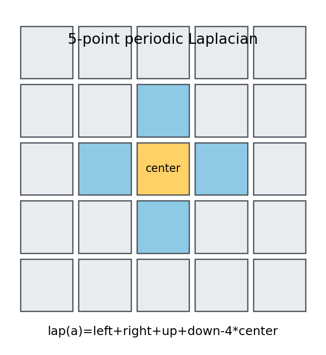

## 1.3 数据集与代码结构

默认任务生成 8 个独立种子，每个样本为 `31×128×128×2`：31 个保存时刻、二维网格，以及 `u/v` 两个通道。HDF5 结构为：

```text
grid/x, grid/y, grid/t
samples/0000/data
samples/0001/data
...
timings
```

代码分工如下：

| 文件 | 职责 |
|---|---|
| `gray_scott.py` | Python、NumPy、Numba 三种同方程后端 |
| `preprocess.py` | 配置快照、周期网格和初始条件 |
| `run_case.py` | 样本调度、集中式 HDF5 写入、生成性能指标 |
| `benchmark.py` | 核心吞吐、端到端加速比和并行效率 |
| `visualize.py` | 方程项、派生场、时空图、频谱和 GIF |
| `parameter_sweep.py` | $F-k$ 参数扫描与模式量化 |
| `pipeline.py` | 从 YAML 驱动全部八个阶段 |
| `verify_results.py` | 12 项自动验收 |

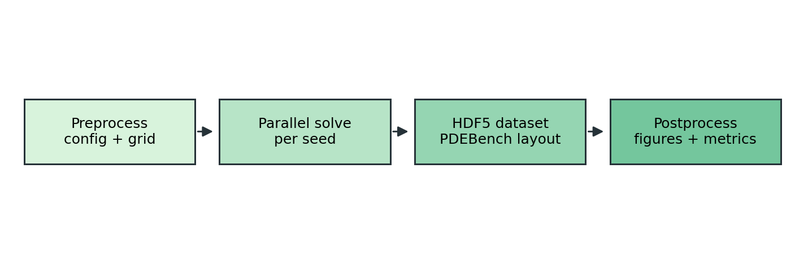

# 2. 前处理

## 2.1 在数据盘创建独立环境

```bash
git clone https://github.com/shenyun114/pdebench_case.git
cd pdebench_case/appendix_gray_scott
export PDEBENCH_CASE_DATA=/home/ubuntu/data
mkdir -p "$PDEBENCH_CASE_DATA/pdebench-case-envs"
conda env create \
  --prefix "$PDEBENCH_CASE_DATA/pdebench-case-envs/gray-scott" \
  -f environment.yml
conda activate "$PDEBENCH_CASE_DATA/pdebench-case-envs/gray-scott"
```

本案例不依赖第二份 PDEBench 源码，也不需要 CUDA。依赖验证与源码语法检查命令为：

```bash
bash scripts/setup_workspace.sh "$PDEBENCH_CASE_DATA/pdebench-gray-scott-demo"
```

## 2.2 配置文件

正式配置位于 [`configs/default.yaml`](configs/default.yaml)，包括四组参数：

| 配置段 | 控制内容 |
|---|---|
| `simulation` | 网格、步数、保存间隔、方程参数 |
| `dataset` | 样本数、种子、后端、executor、worker 数 |
| `benchmark` | 基准规模、重复次数、1/2/4 worker |
| `parameter_sweep` | $F-k$ 组合和扫描规模 |

[`configs/smoke.yaml`](configs/smoke.yaml) 用于数分钟内的流程检查，其分辨率、帧数和参数组合更少，不能替代正式物理结果。

## 2.3 前处理实际生成什么

流水线的前处理阶段生成：

- `resolved_config.yaml`：真正采用的配置副本；
- `case_config.json`：方程参数、字段和 HDF5 布局；
- `grid.npz`：不重复周期端点的 $x/y$ 网格及保存时间；
- `initial_condition.png`：首个种子的 $u/v$ 初场；
- `figures/*.png`：流程、模板和并行粒度示意图。

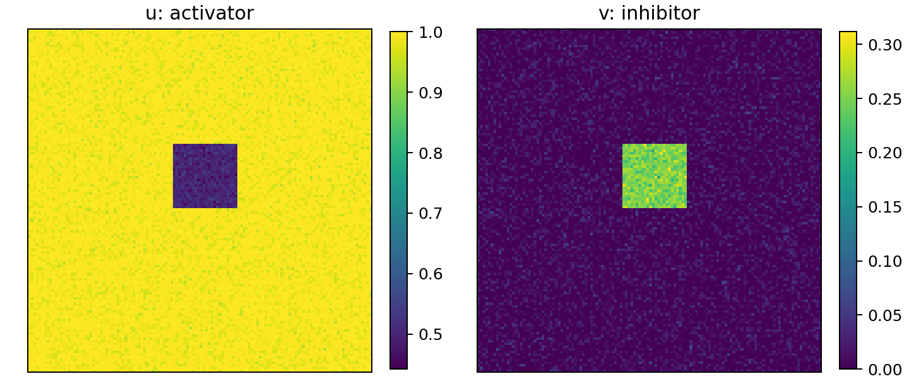

左图中 $u$ 在背景处接近 1、扰动区降低；右图中 $v$ 只在扰动区具有明显浓度。少量噪声不是计算误差，而是用于激发不同空间模态并产生样本多样性。

# 3. 并行优化与数值执行

## 3.1 三种核心后端

三种后端采用同一初值、周期边界、显式 Euler 和 float32 输出：

1. `python`：逐时间、逐 $y$、逐 $x$ 循环，是清晰但缓慢的正确性基线；
2. `numpy`：以 `np.roll` 向量化邻居访问，减少解释器循环；
3. `numba`：把显式模板循环 JIT 编译为本地代码，并用双缓冲避免每步分配数组。

`test_case.py` 会在小网格上比较三条路径，容差为 `rtol=atol=2×10⁻⁵`。这一步先证明优化没有改变数值问题，再讨论速度。

## 3.2 样本级并行为什么合理

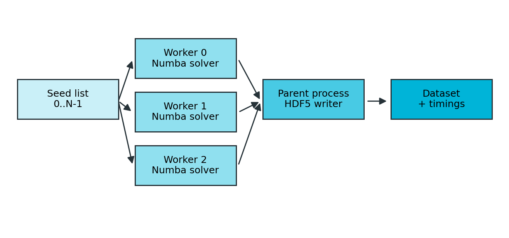

本案例没有把单个 128² 网格做空间域分解，而是把不同 seed 分给线程：

- 每个样本彼此独立，不需要 halo 交换；
- Numba 内核使用 `nogil=True`，多个线程可以并发执行；
- worker 只返回内存数组，由父进程顺序写 HDF5，避免多线程同时修改同一文件；
- 这种粒度适合 PDEBench 式“许多独立初值/参数”的数据集生成。

并行收益不保证线性。任务太小时，JIT 载入、线程调度、数组回传、gzip 压缩与磁盘写入会主导端到端时间；因此性能图同时展示“纯求解核心”和“包含 HDF5 的端到端”结果，不能混为一谈。

## 3.3 一键正式运行

```bash
export PDEBENCH_CASE_DATA=/home/ubuntu/data
conda activate "$PDEBENCH_CASE_DATA/pdebench-case-envs/gray-scott"
cd "$(git rev-parse --show-toplevel)/appendix_gray_scott"

bash scripts/setup_workspace.sh "$PDEBENCH_CASE_DATA/pdebench-gray-scott-demo"
bash scripts/run_pipeline.sh \
  "$PDEBENCH_CASE_DATA/pdebench-gray-scott-demo" \
  configs/default.yaml
```

流水线依次执行：后端一致性测试、前处理、示意图、正式 HDF5、重复性能基准、物理后处理、参数扫描和自动验收。为避免覆盖已有数据，若目标 HDF5 已存在会退出；再次运行应换一个 `WORK_ROOT`。

快速检查可改用：

```bash
bash scripts/setup_workspace.sh "$PDEBENCH_CASE_DATA/pdebench-gray-scott-smoke"
bash scripts/run_pipeline.sh \
  "$PDEBENCH_CASE_DATA/pdebench-gray-scott-smoke" \
  configs/smoke.yaml
```

## 3.4 性能结果应该怎样读

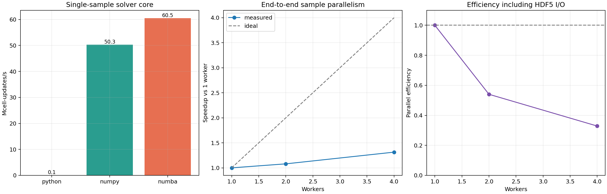

左图比较 Python、NumPy 和 Numba 的单样本核心吞吐，已经在计时前完成 Numba warm-up；中图以 1 worker 端到端时间为基准展示 2/4 worker 加速比，并同时给出理想线；右图给出 $E_p=S_p/p$。默认配置使用 3 次重复的中位数，降低共享服务器偶然负载的影响。

核心吞吐用于判断模板实现效率；端到端结果还包含进程启动、模块导入、任务调度和 HDF5 gzip 写入。因此不能用核心 Numba 吞吐直接推导数据集总耗时，也不能因为 4 worker 没达到 4 倍就断言 Numba 内核没有并行。

本机正式复现采用 3 次运行的中位数：

| 测试 | 中位时间/s | 吞吐/Mcell-updates·s⁻¹ | 加速比 | 效率 |
|---|---:|---:|---:|---:|
| Python 核心，48²×120 | 2.874 | 0.096 | 1.0（吞吐基准） | 不适用 |
| NumPy 核心，96²×360 | 0.066 | 50.34 | 523.3（归一化吞吐比） | 不适用 |
| Numba 核心，96²×360 | 0.055 | 60.54 | 629.3（归一化吞吐比） | 不适用 |
| Numba 端到端，1 worker | 1.334 | 19.90 | 1.000 | 1.000 |
| Numba 端到端，2 workers | 1.235 | 21.50 | 1.080 | 0.540 |
| Numba 端到端，4 workers | 1.015 | 26.15 | 1.314 | 0.329 |

Python 基线使用较小规模以控制测试时间，所以核心的 `523.3/629.3` 是按每秒网格更新数计算的归一化吞吐比，不是同规模墙钟时间之比；真正的并行加速比只在后三行相同工作负载之间计算。4 worker 仅获得 `1.31×`，说明该小任务已明显受到启动、内存带宽和 HDF5 I/O 限制。这是有效的负面性能结论，不应美化为接近线性扩展。

# 4. 后处理与物理分析

## 4.1 输出结构与自动验收

```text
artifacts/
├── resolved_config.yaml
├── pipeline.log
├── command_manifest.json
├── backend_consistency.json
├── case_config.json
├── generation_metrics.json
├── grid.npz
├── initial_condition.png
├── grayscott_dataset.h5
├── figures/
├── benchmark/
│   ├── benchmark.csv
│   ├── benchmark_metrics.json
│   └── benchmark_speedup.png
├── results/
│   ├── physical_metrics.json
│   ├── sample_0000_*.png
│   ├── sample_0000_statistics.csv
│   └── sample_0000_v.gif
├── parameter_sweep/
└── verification.json
```

验收覆盖样本数、形状、种子序列、有限值、后端一致性阶段、斑图存活、Numba 相对 Python 加速、worker 组、图片/GIF 和参数扫描文件。成功结尾必须出现：

```text
PASS: Gray-Scott preprocessing, optimized generation, benchmark and postprocessing are valid
```

正式 4-worker 数据生成本机墙钟时间（含集中式 gzip HDF5 写入）为 `1.942 s`，输出文件约 `20.72 MB`。每个样本的求解计时约 `0.413 s`；多个样本并发，所以不能把 8 个样本时间直接相加当作实际墙钟时间。

## 4.2 原始双场演化

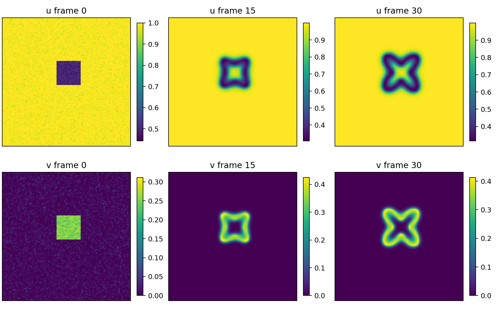

上排为 $u$，下排为 $v$；三列分别是初始、中间和终态。反应活跃区中 $u$ 被 $uv^2$ 消耗，因此通常与 $v$ 的高浓度区互补。终态环带或斑点不是简单扩散的结果：纯扩散只会抹平扰动，持续形态来自自催化、补给、消耗和两种扩散率的竞争。

## 4.3 方程项和图案统计

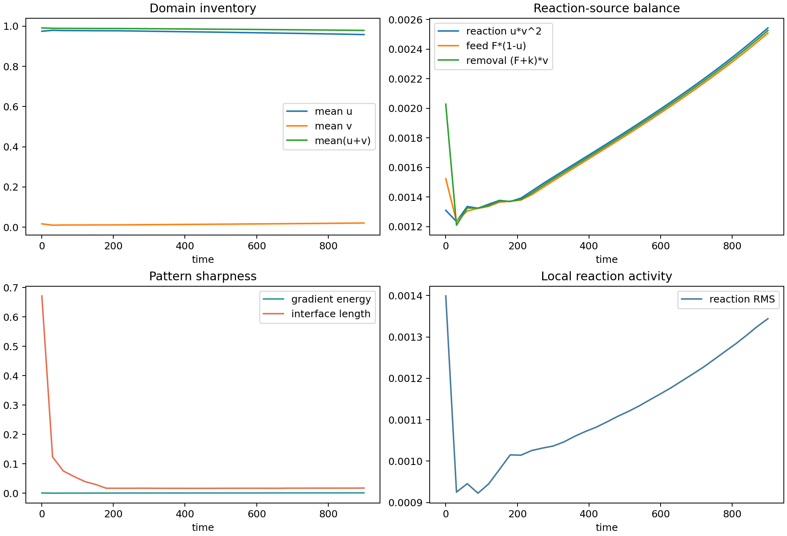

四个面板分别表示：

- `Domain inventory`：全域平均 $u$、$v$ 和 $u+v$。它们不是守恒量，因为系统有外部补给和移除；
- `Reaction-source balance`：$uv^2$、$F(1-u)$、$(F+k)v$ 的空间平均，用来判断生成、补给和消耗是否接近准平衡；
- `Pattern sharpness`：梯度能与阈值界面长度。前者衡量场的粗糙/锐利程度，后者衡量高 $v$ 区域边界复杂度；
- `Local reaction activity`：$uv^2-(F+k)v$ 的 RMS。即使全域平均接近平衡，局部边缘仍可能持续反应。

横轴已经改为真实保存时间，不再只写没有物理尺度的“帧编号”。

## 4.4 派生物理场

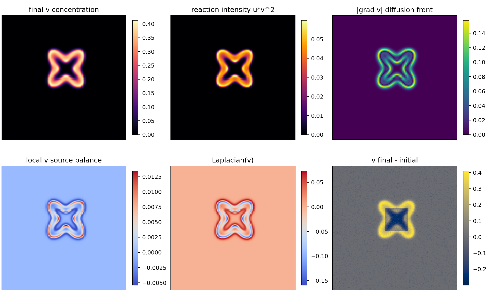

六幅终态图依次是 $v$ 浓度、反应强度 $uv^2$、$|\nabla v|$、局部 $v$ 源汇、$L(v)$ 和 $v(t_f)-v(0)$。高反应强度与高梯度通常集中在图案边缘：内部可能已接近局部平衡，而边缘同时具有反应物供应、产物和扩散通量，是结构继续移动或调整的位置。

`Laplacian(v)` 的正负不表示浓度正负，而表示扩散对该点的瞬时推动方向：局部谷值通常得到正扩散贡献，局部峰值通常得到负贡献。

样本 0000 在 $t=0\to900$ 间，平均 $v$ 从 `0.0166` 增至 `0.0207`，平均反应率从 `1.31×10⁻³` 增至 `2.54×10⁻³`；终态补给 `2.51×10⁻³`、反应 `2.54×10⁻³`、移除 `2.53×10⁻³` 已接近，但局部源汇 RMS 仍为 `1.34×10⁻³`。因此可以称为全域统计上的准平衡，不能说每个网格点都已停止演化。

## 4.5 时空切片、频谱和 GIF

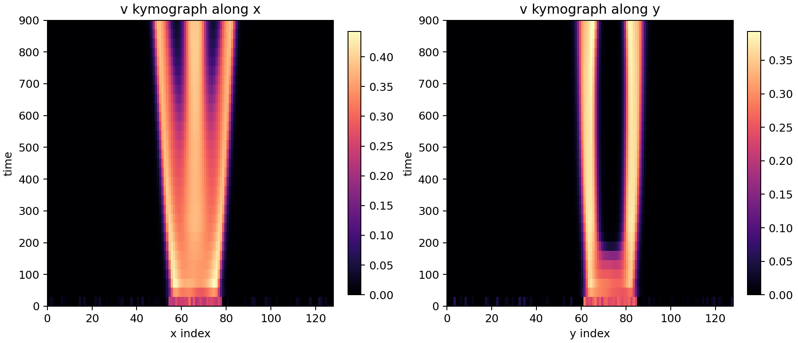

时空图分别抽取中心水平线和竖直线。向外分开的亮带代表 $v$ 高浓度前沿扩张；亮带位置稳定则表示主要边界趋于静止。它比单张终态图更能区分“静态环带”和“仍在传播的前沿”。

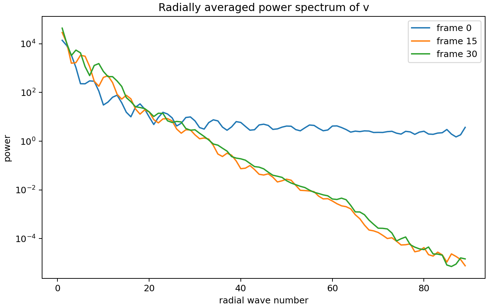

径向频谱把二维 FFT 功率按波数半径平均。高波数对应细碎纹理，低波数对应大尺度结构；从初始到终态的能量重分配说明随机扰动经过动力学选择，形成占优空间尺度。

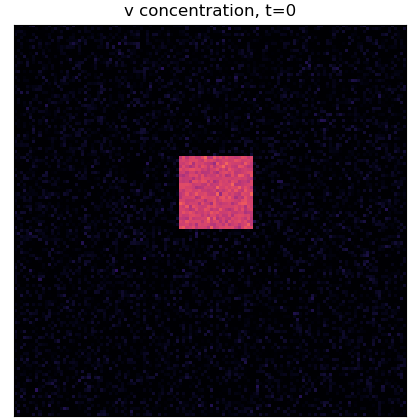

GIF 使用全时段统一色标，标题给出数值时间。播放时应关注中心扰动是否扩张、分裂或衰灭，以及最终图案是否仍在缓慢调整。

## 4.6 多样本与参数扫描

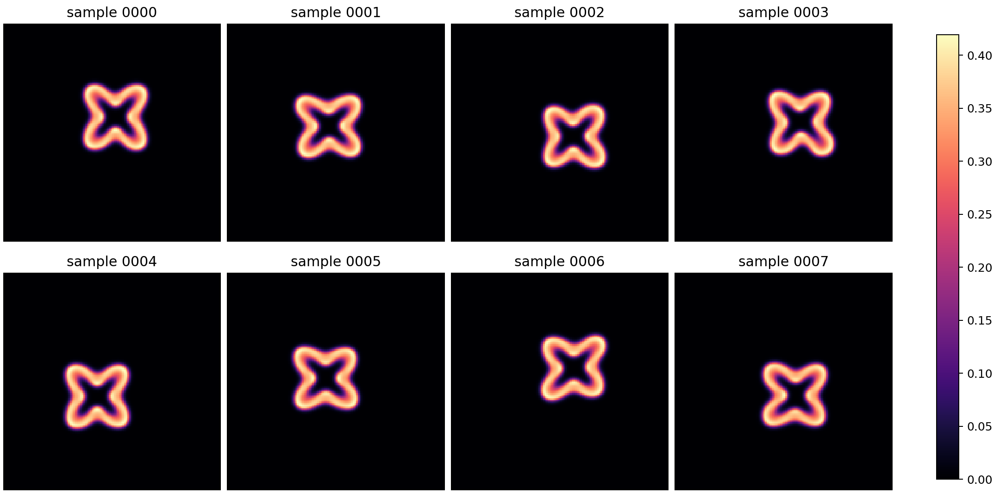

八个样本使用相同方程参数但不同 seed。共同的形态尺度反映确定性动力学，位置和局部边界差异反映初始扰动；这正是小型监督学习数据集希望保留的“同一物理规律下的样本变化”。

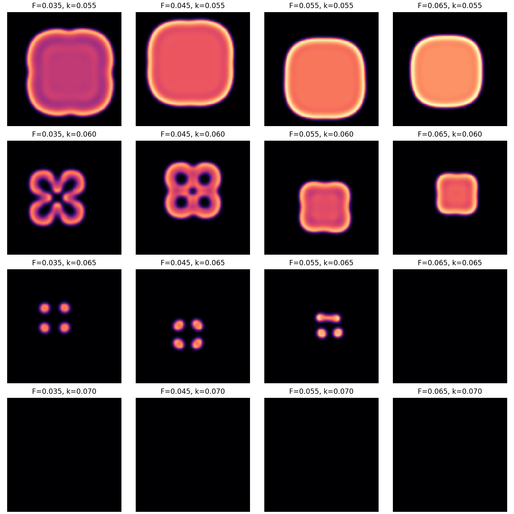

相图横向改变补给 $F$，纵向改变消耗 $k$。较低 $k$ 允许 $v$ 大范围存活；提高 $k$ 后结构收缩为孤立斑点，继续提高会进入衰灭态。所有小图采用同一色标，因此暗图确实代表低浓度，而不是每幅图自动拉伸后的视觉假象。

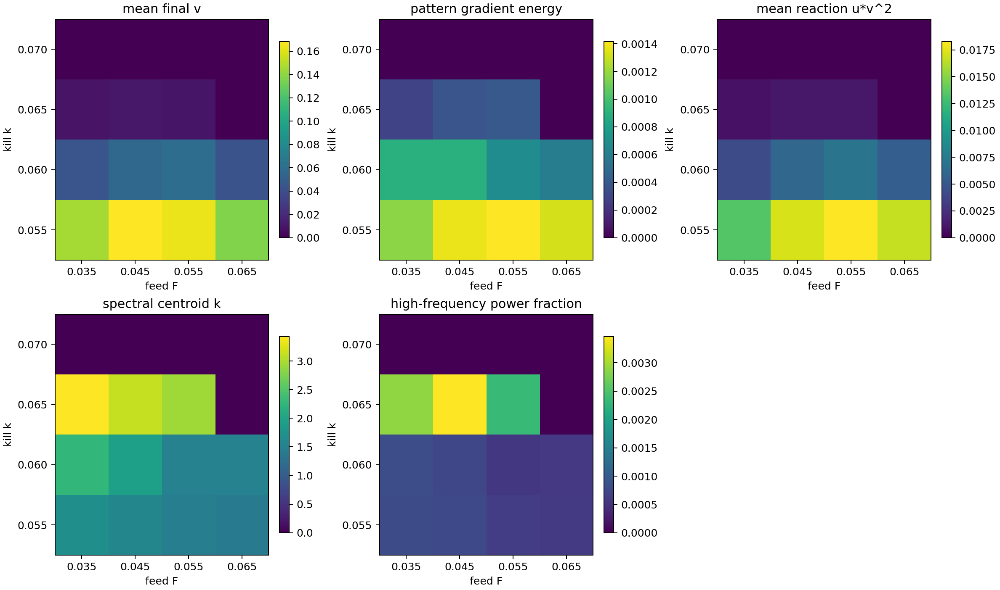

热图把视觉模式量化为平均 $v$、梯度能、平均反应率、谱质心和高频功率比例。完全衰灭场会先通过幅值阈值识别，再把频谱指标置零，避免把浮点舍入噪声解释为细尺度结构。

## 4.7 适用范围和进一步扩展

- 当前并行是共享内存样本级线程，不是 MPI 空间域分解；
- 性能数字只代表记录的软硬件与当时负载，应复跑 `benchmark.py`，不宜跨机器照搬；
- 显式 Euler 简单易讲，但更细网格或重新引入有量纲 $\Delta x$ 后可能受扩散稳定性强烈限制；
- 若接入 FNO/U-Net，建议除 RMSE 外评价反应项、谱质心、界面长度和参数模式分类；
- 若扩大到节点间数据生成，可让每个进程负责一组 seed 并分别写分片文件，最后合并，避免共享 HDF5 写锁。

## 4.8 参考

- [PDEBench 官方仓库](https://github.com/pdebench/PDEBench)
- Pearson, J. E. (1993), *Complex Patterns in a Simple System*, Science 261(5118)
- 本案例参考了 PDEBench 多初值数据生成和 HDF5 组织思想，但 Gray–Scott 求解器是案例自包含实现。
